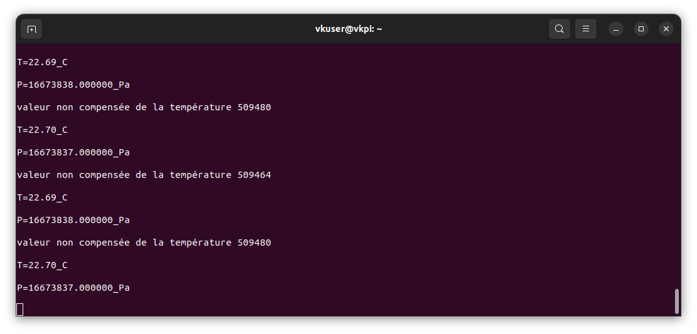
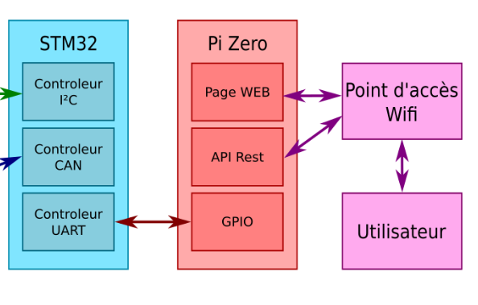
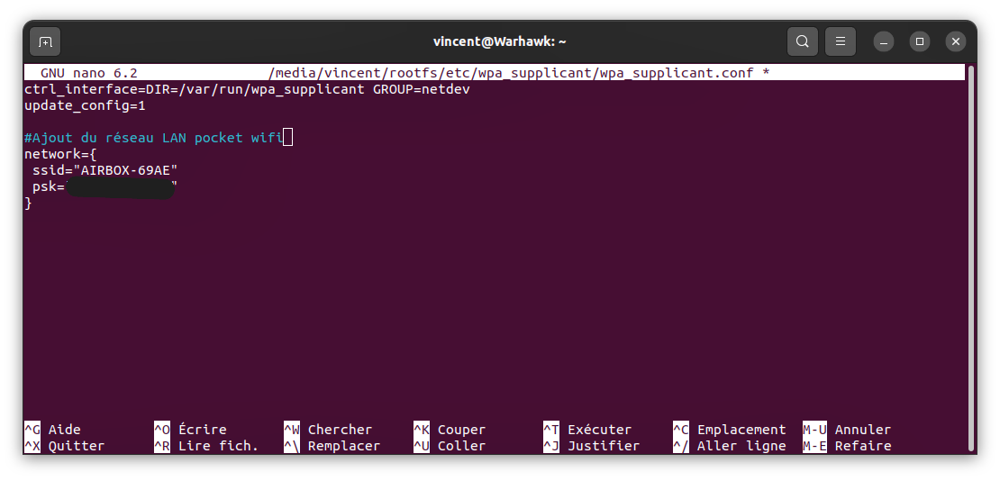

# 🚀TP de Bus_Réseaux

    
 [](https://www.ensea.fr)
  

Ceci est le compte-rendu du TP de bus et réseau de Vincent LAKHMECHE et Karim JERJOUB

Certaines images ne s'affichent pas dans ce readme, une version complète est disponible en pdf à la racine du repo.
Vidéos disponibles en haute définition en annexe.

<!-- TOC start -->


- [🚌 2. TP1- Bus I2C](#-2-tp1--bus-i2c-1)
   * [🛰️2.1 Capteur BMP280](#-21-capteur-bmp280)
   * [💻2.2. Setup du STM32](#22-setup-du-stm32)

     [Redirection du print](#redirection-du-print)

     [Test de la chaîne de compilation et communication UART sur USB](#test-de-la-chaîne-de-compilation-et-communication-uart-sur-usb)
   * [📡2.3. Communication I²C](#23-communication-ic)
      + [🆔Identification du BMP280 : CheckID](#identification-du-bmp280--checkid)
      + [⚙️Configuration du BMP280 ](#configuration-du-bmp280)
         - [⚡Contrôle du mode d'alimentation](#contrôle-du-mode-dalimentation)
         - [🌪️Contrôle de la mesure de pression ](#contrôle-de-la-mesure-de-pression)
         - [🌡️Contrôle de la mesure de température](#contrôle-de-la-mesure-de-température)
      + [📏Récupération de l'étalonnage de la température et de la pression ](#récupération-de-létalonnage-de-la-température-et-de-la-pression)
         - [📉 Étalonnage du composant](#-étalonnage-du-composant)
         - [🌡️ Récupération de la température et de la pression ](#-récupération-de-la-température-et-de-la-pression)
      + [🔢 Calcul des températures et des pression compensées](#-calcul-des-températures-et-des-pression-compensées)
- [🍓-🖥️ 3. TP2 - Interfaçage STM32 - Raspberry](#-3-tp2-interfaçage-stm32-raspberry-1)
   * [🐧 3.1. Mise en route du Raspberry PI Zéro](#-31-mise-en-route-du-raspberry-pi-zéro)
      + [Premier démarrage](#premier-démarrage)
   * [3.2 Port série ](#32-port-série)
      + [🔄 Loopback](#-loopback)
         - [Activation de l'usart dans la PI ZERO](#activation-de-lusart-dans-la-pi-zero)
      + [🖧 Communication avec le STM32	](#-communication-avec-le-stm32)
         - [📱 Communication entre la PI zero et le STM32](#-communication-entre-la-pi-zero-et-le-stm32)
         - [Test d'envoi des ordres à la STM32 ](#test-denvoi-des-ordres-à-la-stm32)
   * [🐍 3.3 Commande depuis Python ](#-33-commande-depuis-python)
- [🌐 4. TP3- Interface REST](#-4-tp3--interface-rest-1)
   * [🐍 4.1. Installation du serveur Python](#-41-installation-du-serveur-python)
   * [4.2 Première page REST](#42-première-page-rest)
   * [4.3. Nouvelles métodes HTTP](#43-nouvelles-métodes-http)
- [🛠️ 5.TP4 : CAN](#-5-tp4--can)
   * [🚘 5.1 Pilotage du moteur ](#-51-pilotage-du-moteur)
   * [📟 5.2. Interfaçage avec le capteur](#-52-interfaçage-avec-le-capteur)
- [🚀 5.TP5 : Mise en série de l'ensemble](#-5tp5--mise-en-série-de-lensemble)

	 [Conclusion](#conclusion-)

<!-- TOC end -->


### 🎥  [Accédez à la vidéo en Haute Définition ici.✨](./VidéoDémoChaineFonctionnelle)

<p align="center">
  <video src="https://github.com/user-attachments/assets/9af4967f-7dbb-4031-a4d5-ade751fe747b"></video>
</p>


<p align="center">
 <video src="https://github.com/user-attachments/assets/7757d12c-c4bc-47a1-8fb2-f3cbd6ec4d23" alt="image">
</p>


## 🌐 2. TP1- Bus I2C ##

- 🔌 2.1 Capteur BMP280
- 📱 2.2. Setup du STM32
  - Redirection du print
  - Test de la chaîne de compilation et communication UART sur USB
- 🔄 2.3. Communication I²C
  - 🆔 Identification du BMP280 : CheckID
  - ⚙️ Configuration du BMP280
  - ⚡ Contrôle du mode d'alimentation
  - 📊 Contrôle de la mesure de pression
  - 🌡️ Contrôle de la mesure de température
  - 📈 Récupération de l'étalonnage de la température et de la pression
  - 📋 Étalonnage du composant
  - 🌡️ Récupération de la température et de la pression
  - 🧮 Calcul des températures et des pression compensées

## 🍓 💻 3. TP2 - Interfaçage STM32 - Raspberry

- 👤 3.1. Mise en route du Raspberry PI Zéro
  - Premier démarrage
- 3.2 Port série
  - 🔄 Loopback
  - ⚡ Activation de l'usart dans la PI ZERO
  - 🔌 Communication avec le STM32
  - 🧪 Test d'envoi des ordres à la STM32
- 🐍 3.3 Commande depuis Python

## 🌐 4. TP3- Interface REST

- 🐍 4.1. Installation du serveur Python
- 📄 4.2 Première page REST
- 🔄 4.3. Nouvelles méthodes HTTP

## ⚡ 5. TP4 : CAN

- 🎮 5.1 Pilotage du moteur
- 📡 5.2. Interfaçage avec le capteur

## 🚀 5. TP5 : Mise en série de l'ensemble

- 📝 Conclusion

------


## 🚌 2. TP1- Bus I2C

🎯 L' objectif de cette partie est de mettre en place la communication entre le microcontrôleur et les capteurs (température, pression, accéléromètre...) via le bus I²C


<p align="center">
 
</p>

### 🛰️2.1 Capteur BMP280

Mise en œuvre du BMP280 

Toutes les communications avec l'équipement (le capteur I2C) sont réalisées en lisant et en écrivant dans des registres. 

​		--> Ces registres sont sur une largeur de 8 bits et sont décrits ci-dessous. 

1. Quelles sont les adresses I²C possibles pour ce composant.

   Il y a deux adresses possibles en fonction de SDO, s'il est connecté à la masse (**0x76**) ou à Vcc (**0x77**).

   On peut lire en page 28 de la datasheet que l'équipement possède une adresse sur 7 bits qui est '111011x' . Les 6 premiers bits, ceux de poids fort, sont différents de 'x'. Le caractère 'x' sert à indiquer que le bit de poids faible n'est pas fixé . 
   
   **Dans notre cas, l’adresse I2C du BMP280 est de 0x77**.
   
2. Identifier le registre et la valeur permettant d'identifier ce composant.
   
   Le registre d'identification (ID) est à l'adresse **0xD0**, sa valeur est **0x58** pour le BMP280
   
3. Identifier le registre et la valeur permettant de placer le composant en mode normal.

   Le registre de contrôle **ctrl_meas** (adresse **0xF4**) permet de définir le mode de fonctionnement.

   Les bits mode[1:0] doivent être configurés à '11' pour le mode normal.
   
4. Identifier les registres contenant l'étalonnage du composant.

   Les données d'étalonnage sont stockées dans les registres de **0x88** à **0xA1**
   
5. Identifier les registres contenant la température (ainsi que le format).

   Les données de température sont réparties sur trois registres : **0xFA** (MSB), **0xFB** (LSB), et **0xFC** (XLSB).

   Le format est une valeur non signée de 20 bits : le MSB contient les bits [19:12], le LSB les bits [11:4], et le XLSB les bits [3:0].
   
6. Identifier les registres contenant la pression (ainsi que le format).

   Les données de pression sont également réparties sur trois registres : **0xF7** (MSB), **0xF8** (LSB), et **0xF9** (XLSB).

   Le format est une valeur non signée de 20 bits, similaire à celui des données de température.
   
7. .Identifier les fonctions permettant le calcul de la température et de la pression compensées, en format entier 32 bits.   

​	La fonction pour la compensation de la température est **bmp280_compensate_T_int32(BMP280_S32_t adc_P)** 
​	Celle pour la pression est **bmp280_compensate_P_int64(BMP280_S32_t adc_T)**. 
​	Ces fonctions utilisent des entiers 32 bits pour les calculs de compensation.


### 💻2.2. Setup du STM32

La carte utilisée est une carte de développement STM32 NUCLEO-F446RE.

La figure suivante montrent les signaux connectés par défaut aux connecteurs ARDUINO® Uno V3 (CN5, CN6, CN8, CN9) et au connecteur ST morpho (CN7 et CN10), on retrouve une figure pour chaque carte STM32 Nucleo page 35 de la datasheet :

 [user manual : dm00105823-stm32-nucleo64-boards-mb1136-stmicroelectronics.pdf](docs_annexes/datasheet documents/dm00105823-stm32-nucleo64-boards-mb1136-stmicroelectronics.pdf) 


<p align="center">
 
</p>


On doit câbler la carte fille qui contient les composants (capteurs) dont le BMP280 . Il faut faire **attention au câblage**  qui a été une source d'erreur et une grande perte de temps.

Le points à contrôler sont : 

-les pins GPIO sur lesquels l'I²C est configurée dans l'ioc

-les pins PHYSIQUE sur lesquels on branche le câble SCL (câble jaune) et SDA (câble blanc)   

-les pins physiques sur lesquels on branche le câble rouge VCC (sur un pin 3.3V de la nucleo ), et le câble GND sur un pin GND de la nucleo.

Une fois le STM32 configuré, nous obtenons la figure suivante de l'ioc après configuration.

Figure du câblage dans l'ioc du STM32 pour la connexion logicielle (pins) : 


Voici où sont situés les signaux du bus I²C : 


<p align="center">
 
</p>

​	

​	I2C1_SDA est sur **PB9** 

​	I2C1_SCL est sur **PB8** 


Pour la liaison UART sur USB dont nous avons besoin, nous allons utiliser **l'USART2** sur le broches suivantes : 

USART 2 :
	-TX sur **PA2** 
	-Et RX sur **PA3**

Pour communiquer avec la Raspberry PI0 dans le TP2, nous allons communiquer à l'aide d'une autre connexion UART, **l'USART1**. 
Le signal TX est connecté sur les broches **PA9** et le signal RX sur **PA10**.

Les pins PB9 et PB8 se trouvent à droite de la carte en haut comme on peut le voir sur la figure de la carte ci-dessus. 

Attention le pin PB8 commence au deuxième pins sur les connecteurs morpho.

On rappel que le signal SDA sur PB9 et SCL sur PB8.

Tandis que l 3.3 V pour VCC et le GND sont à gauche de la carte( on peut utiliser d'autres GND situé sur la carte qu'à gauche mais visuellement c'est plus pratique pour vérifier le câblage s'ils sont isolés d'un côté et les pins I2C d'un autre).


MAJ du TP4 : Il faut déplacer l'I²C de ces pins afin de les libérer pour le bus CAN toujours avec l'I2C1, les signaux du bus I²C seront :

| PB7 pour SDA | PB6 pour SCL |
| ------------ | ------------ |


D'un CAN 

*****************Problèmes cube ide****************************

```bash
sudo apt-get install libncurses5
Lecture des listes de paquets... Fait
Construction de l'arbre des dépendances... Fait
Lecture des informations d'état... Fait      
Les paquets supplémentaires suivants seront installés : 
  libtinfo5
Les NOUVEAUX paquets suivants seront installés :
  libncurses5 libtinfo5
0 mis à jour, 2 nouvellement installés, 0 à enlever et 6 non mis à jour.
Il est nécessaire de prendre 207 ko dans les archives.
Après cette opération, 883 ko d'espace disque supplémentaires seront utilisés.
Souhaitez-vous continuer ? [O/n] o
Réception de :1 http://fr.archive.ubuntu.com/ubuntu jammy-updates/universe amd64 libtinfo5 amd64 6.3-2ubuntu0.1 [100 kB]
Réception de :2 http://fr.archive.ubuntu.com/ubuntu jammy-updates/universe amd64 libncurses5 amd64 6.3-2ubuntu0.1 [107 kB]
207 ko réceptionnés en 0s (974 ko/s)   
Sélection du paquet libtinfo5:amd64 précédemment désélectionné.
(Lecture de la base de données... 283299 fichiers et répertoires déjà installés.)
Préparation du dépaquetage de .../libtinfo5_6.3-2ubuntu0.1_amd64.deb ...
Dépaquetage de libtinfo5:amd64 (6.3-2ubuntu0.1) ...
Sélection du paquet libncurses5:amd64 précédemment désélectionné.
Préparation du dépaquetage de .../libncurses5_6.3-2ubuntu0.1_amd64.deb ...
Dépaquetage de libncurses5:amd64 (6.3-2ubuntu0.1) ...
Paramétrage de libtinfo5:amd64 (6.3-2ubuntu0.1) ...
Paramétrage de libncurses5:amd64 (6.3-2ubuntu0.1) ...
Traitement des actions différées (« triggers ») pour libc-bin (2.35-0ubuntu3.8) ...

```


*************************************

##### Redirection du print

Afin de pouvoir facilement déboguer votre programme STM32, faites en sorte que la fonction printf renvoie bien ses chaînes de caractères sur  la liaison UART sur USB, en ajoutant le code suivant au fichier  stm32f4xx_hal_msp.c :

```c
/* USER CODE BEGIN PV */
extern UART_HandleTypeDef huart2;
/* USER CODE END PV */
/* USER CODE BEGIN Macro */
#ifdef __GNUC__ /* With GCC/RAISONANCE, small printf (option LD Linker->Libraries->Small printf    set to 'Yes') calls __io_putchar() */
#define PUTCHAR_PROTOTYPE int __io_putchar(int ch)
#else
#define PUTCHAR_PROTOTYPE int fputc(int ch, FILE *f)
#endif /* __GNUC__ */
/* USER CODE END Macro */
/* USER CODE BEGIN 1 */
/**
  * @brief  Retargets the C library printf function to the USART.
  * @param  None
  * @retval None
  */
PUTCHAR_PROTOTYPE
{
  /* Place your implementation of fputc here */
  /* e.g. write a character to the USART2 and Loop until the end of transmission */
  HAL_UART_Transmit(&huart2, (uint8_t *)&ch, 1, 0xFFFF);

  return ch;
}
/* USER CODE END 1 */
```


*********************************************

##### Test de la chaîne de compilation et communication UART sur USB

Si `ttyAMA0` est occupé, il faut penser à le libérer sur la raspberry pour pouvoir lancer minicom.

On utilise la commande suivante pour lancer `minicom` sur le bon port :

```bash
sudo minicom -D /dev/ttyACM0 # pour lancer minicom sur la nucleo

minicom -b 115200 -o -D /dev/ttyAMA0 #pourle lancer sur la pi zero
```

Une fois la commande lancée, le code écrit dans le main (la ligne du printf) doit s'afficher dans le terminal minicom.

<p align="center">
 
</p>

L'affichage est décalé car il manquait le \r pour le retour chariot 

```c
printf("Hello from STM32!\r\n");
```

Maintenant l'affichage est centré à gauche comme on peut le voir :

<p align="center">
 
</p>


### 📡2.3. Communication I²C

On va ajouter tout le code nécessaire pour manipuler le composant dans des fonctions dont la syntaxe pour rédiger leurs signatures sera BMP280_fonction_a_coder(). Elles seront déclarées dans le fichier header BMP280_vincent.h et implémentées dans le fichier qui sera appelé BMP280_vincent.c. 


___

#### 🆔Identification du BMP280 : CheckID

On doit vérifier que le contenu du registre correspond bien à la datasheet.

L'identification du BMP280 consiste en la lecture du registre ID.

La première fonction qu'on code est donc la vérification de l’id de l’équipement I²C . 

On obtient sa réponse avec la fonction HAL_Receive (). Le buffer passé en argument de cette fonction sera écrasé par les data transmises par le composant I²C.  Ce buffer doit être de type uint8_t sinon les octets transmis ne seront pas bien stockés.

**Nous avons donc implémenté la fonction checkID().** 

**code de la fonction checkID() :** 

```c
int BMP280_checkID(void) {


	//FOnctionnel au 23 oct 18h59 <<<<<<< aussi 9 nov 19h34 organisé

	uint8_t buf[10];
	buf[0]=BMP280_ID_REG;

	retour = HAL_I2C_Master_Transmit(&hi2c1, BMP280_ADDR, buf, 1, -1);

	printf("transmission in progress\r\n");

	if(retour != HAL_OK){

		printf(" \n problem during transmission \r\n");

		return 1;

	}
	else{
		printf("no problem during transmission | transmission complete -> reception in progress\r\n");
	}


	retour = HAL_I2C_Master_Receive(&hi2c1, BMP280_ADDR, buf, 1, -1);
	if(retour != HAL_OK){

		printf(" \n problem during reception I2C\r\n");

		return 1;

	}
	else{

		printf("\n reception complete ...  : Register Id content : 0x%x\r\n", buf[0]);
	}

}
```

<p align="center">
 
</p>


On peut lire comme contenu du registre : **0x58**.  C 'est bien la valeur attendue pour le registre **0xD0**.


***


#### ⚙️Configuration du BMP280 

Avant de pouvoir faire une mesure, il faut configurer le BMP280.

La configuration à mettre en place dans le composant est la suivante: mode normal, Pressure oversampling x16, Temperature oversampling x2

Pour cela il faut écrire les bonnes valeurs dans les bons registres conformément à la datasheet. 

En I²C, l'écriture dans un registre se déroule de la manière suivante:

1. envoyer l'adresse du registre à écrire, suivi de la valeur du registre
2. si on reçoit immédiatement (avec Receive()), la valeur reçue sera la nouvelle valeur du registre)

La lecture de la valeur reçue en 2 nous permet de vérifier que la configuration a bien été écrite dans le registre.


Registres concernés pour établir la configuration voulue dans la documentation : mode normal - Pressure oversampling x16 - Temperature oversampling x2 

<p align="center">
 
</p>


Tous les registres à configurer sont des sous-parties du registre **ctrl_meas** : les bits 7 à 5 pour l‘oversampling de temperature , 4 à 2 pour l‘oversampling de la pression. 

Il faudra donc modifier les bits de bon poids à l’adresse du registre **ctrl_meas** pour modifier le paramètre voulu (mode power normal, oversampling) mais tous situés à l’adresse 0xF4.

Les paramètres binaires à mettre sont aussi décrits page 25 de la datasheet pour chaque paramètres d’oversampling et de mode voulu il y a un mot binaire associé.

<p align="center">
 
</p>


***


##### ⚡Contrôle du mode d'alimentation

ll faut placer le composant en mode normal, les configurations possibles et leurs valeurs binaires associées du registre mode[1:0] sont décrites dans le tableau suivant page 15 : 

<p align="center">
 
</p>

  	

| Adresse registre ctrl_meas | Valeur à écrire                                              |
| -------------------------- | ------------------------------------------------------------ |
| 0xF4                       | Les bits mode[1:0] doivent être configurés à '11' pour le mode normal. |


***


##### 🌪️Contrôle de la mesure de pression 

On souhaite paramétrer Pressure oversampling en x16. 

En page 12, on lit : Pour activer l’oversampling de la pression (et la mesure), il faut sélectionner les bits [2:0] du registre de control osrs_p à l’adresse 0xF4. 
Les configurations possibles et valeurs associés du registre osrs_p ne pas sont décrites en p.13 dans le tableau ci-dessous.

<p align="center">
 
</p>


Mais dans le tableau 21, ci-dessous les exemples de configuration avec l'oversampling sont détaillés en page 25 :

<p align="center">
 
</p>


 

On va choisir le mot binaire ‘101’ qui correspond à ce que l’on souhaite (oversampling x16) comme configuration. 

La valeur '101' à écrire dans le code est notée 0b101. 


***


##### 🌡️Contrôle de la mesure de température

On souhaite paramétrer Temperature oversampling à x2 

Pour activer l’oversampling de la température (et la mesure), il faut sélectionner les bits [2:0] du registre de control osrs_t toujours à l’adresse 0xF4 

Les configurations possibles et valeurs possibles du registre osrs_t sont tout de suite décrites dans le tableau 5 suivant page 13 :  

<p align="center">
 
</p>


Ou dans le tableau 22 page 25 : 

<p align="center">
 
</p>


On va choisir le mot binaire ‘010’ qui correspond à ce que l’on souhaite (oversampling x2) comme configuration. 

Il faut écrire dans les bits 7 à 5 du registre le mot binaire ’010’ qu’on notera dans le code C “0b010”. 

***

Fin des explications de la datasheet

***


On va ajouter tout le code nécessaire pour configurer le composant dans une fonction BMP280_config() qui sera dans le fichier driver.c qui sera accompagné de son fichier driver.h 


En I²C, l'écriture dans un registre se déroule de la manière suivante : 

1. envoyer l'adresse du registre à écrire, suivi de la valeur du registre 
2. si on reçoit immédiatement, la valeur reçu, lorsque l’on essaie de lire le bus, sera la nouvelle valeur du registre 

**************************

Code du bmp  


```c
uint8_t config = (0b010<<5)|(0b101<<2)|(0b11);  
```


(0b010<<5)pour remplir les bits [7:5] soit les bit 7 à 5 soit **osrs_t [2:0]** 

**`0b010 << 5`** : 

- `0b010` est `2` en décimal.
- Décalage de 5 bits vers la gauche : `0b01000000`, soit `64` en décimal


(0b101<<2) pour remplir les bits [4:2] (bits 4 à 2) soit **osrs_p [2:0]** 

**`0b101 << 2`** :

- `0b101` est `5` en décimal.
- Décalage de 2 bits vers la gauche : `0b00010100`, soit `20` en décimal.


(0b11) pour remplir les bits [1:0] soit **mode [1:0]** 

**`0b11`** :

- `0b11` est `3` en décimal et n'est pas décalé.

  

  

  <p align="center">
   
  </p>
  
  

La valeur de `config` est donc **0x57** en hexadécimal, soit **0d87** en décimal, et **0b01010111** en binaire.


On lit bien sur l'USART la valeur renvoyée par le capteur suite à la configuration, affiché en hexadécimal grâce à %x :


**Printf - paramètres :**

Le spécificateur de format **%d** est utilisé pour afficher un entier. 

**%u** est utilisé pour afficher le contenu de la variable en décimal (entiers non signé) .

**%x** sert à afficher le contenu de la variable en hexadécimal .


___


#### 📏Récupération de l'étalonnage de la température et de la pression 


##### 📉 Étalonnage du composant

Pour récupérer les valeurs d’étalonnage, on envoie l’adresse la plus basse du registre des valeurs d’étalonnage et on réceptionne les 24 valeurs d’étalonnage.


<p align="center">
 
</p>


La figure provient de la page 21 de la datasheet et nous donne les adresses et les valeurs contenues dans ces registres.

| Adresse registres étalonnage                          | Valeur à écrire                                              |
| ----------------------------------------------------- | ------------------------------------------------------------ |
| **0x88** [136 en décimal] à **0xA1** [160 en décimal] | Les bits mode[7:0] doivent être configurés à 11 pour le mode normal. |


Code pour l'étalonnage 

On va faire une demande de lecture qui commence avec Transmit() puis Receive().

La lecture se déroule avec l'envoi de l'adresse du registre **0x88** ( qui correspond au registre calib00 de calibration (étalonnage) la plus basse valeur des adresses de registres d'étalonnage ) et on reçoit 1 octet correspondant au contenu du registre.

On ajoute la constante dans le fichier BMP280_vincent.h suivante :

```c
typedef uint32_t BMP280_U32_t;
typedef int32_t BMP280_S32_t;
typedef int64_t BMP280_S64_t;

static const uint8_t BMP280_ADDR = 0x77 << 1; // Use 8-bit address
// static const uint8_t BMP280_ADDR = 0x76 << 1; // Use 8-bit address

static const uint8_t BMP280_ID_REG = 0xD0;//id du registre selon la doc

static const uint8_t BMP280_TRIM_REG_MSB = 0x88;
```

La fonction BMP280_calib() contient le code suivant pour avoir les registres d'étalonnage : 

```c
void BMP280_calib(void) {
	//**********à supprimer

	// uint8_t etalo = 0x88; //Adresse du premier registre contenant les valeurs d'étalonnage
	//buf_adr[0]=etalo; //buffer contenant l'adresse du registre d'étalonnage

	//**********************

	uint8_t buf_data[24];	//buffer pour les données reçues des registre

	//on demande la lecture avec le transmit

	//BMP280_TRIM_REG_MSB  est déclarée dans BMP280_vincent.h

	// l'adresse de la variable BMP280_TRIM_REG_MSB est passée a la fonction qui attends une adresse en paramètre (celle sur laquelle pointerait le pointeur pData)
	retour = HAL_I2C_Master_Transmit(&hi2c1, BMP280_ADDR, &BMP280_TRIM_REG_MSB,1, HAL_MAX_DELAY);

	if (retour != HAL_OK) {
		printf("Probleme calib I2C\r\n");
		return;
	}
	//on lit la réponse qu'on stocke dans le buffer buf_data
	retour = HAL_I2C_Master_Receive(&hi2c1, BMP280_ADDR, buf_data, 24,HAL_MAX_DELAY);

	if (retour != HAL_OK) {
		printf("Problem calib I2C\r\n");;


	}
	else {	//on affiche les données d'étallonage reçues

	}
	dig_T1 = buf_data[0] | (buf_data[1] << 8);
	dig_T2 = buf_data[2] | (buf_data[3] << 8);
	dig_T3 = buf_data[4] | (buf_data[5] << 8);
	dig_P1 = buf_data[6] | (buf_data[7] << 8);
	dig_P2 = buf_data[8] | (buf_data[9] << 8);
	dig_P3 = buf_data[10] | (buf_data[11] << 8);
	dig_P4 = buf_data[12] | (buf_data[13] << 8);
	dig_P5 = buf_data[14] | (buf_data[15] << 8);
	dig_P6 = buf_data[16] | (buf_data[17] << 8);
	dig_P7 = buf_data[18] | (buf_data[19] << 8);
	dig_P8 = buf_data[20] | (buf_data[21] << 8);
	dig_P9 = buf_data[22] | (buf_data[23] << 8);
	for (int i = 0; i < 24; i++) {
		printf("\ni :%d\r\n",i);
		printf("dans boucle for //registre d'etallonage calib= %d \r\n ", buf_data[i]);


	}
	
}
```

Voici l'état actuel du driver BMP280_vincent.c avec les trois dernières fonctions implémentées.

```c
#include "stdio.h"
#include "stdlib.h"

#include "main.h"
#include "BMP280_vincent.h"

extern I2C_HandleTypeDef hi2c1;

uint16_t dig_T1;
int16_t dig_T2;
int16_t dig_T3;
uint16_t dig_P1;
int16_t dig_P2;
int16_t dig_P3;
int16_t dig_P4;
int16_t dig_P5;
int16_t dig_P6;
int16_t dig_P7;
int16_t dig_P8;
int16_t dig_P9;
  

  
 
  //envoyer une trame avec l'adresse du registre à l'aide de la fonction HAL_I2C_Master_Transmit().
  //buf[0]=BMP_ID_REG;
  //HAL_I2C_Master_Transmit(&hi2c1, BMP280_ADDR, buf, 1, -1);

  //HAL_I2C_Master_Receive(&hi2c1, BMP280_ADDR, buf, 1, -1);
  //printf("Idreg: 0x%x\r\n", buf[0]); 
  
 int BMP280_checkID(void){ 

    uint8_t buffer[1]; 
	buf[0] = BMP280_ID_REG;
    retour = HAL_I2C_Master_Transmit(&hi2c1,BMP280_ADDR, &ID_address, 1, HAL_MAX_DELAY); 

    if(retour != HAL_OK){ 

        printf("Problème avec l'I2C\r\n"); 

        return 1; 

    } 

    retour = HAL_I2C_Master_Receive(&hi2c1, BMP280_ADDR, buffer, 1, HAL_MAX_DELAY); 

    if(retour != HAL_OK){ 

        printf("Problème avec l'I2C\r\n"); 

        return 1; 

    } 

    printf("L'ID du capteur est 0x%x\r\n",buffer[0]); 

    return 0; 

} 		 
  
 int BMP280_config(void){ 

    //uint8_t buffer[1]; 

    uint8_t buf[2]; 

    buf[0]= ctrl_meas; 

    buf[1]= config;//mot binaire a ecrire pour conf correctement 

    retour = HAL_I2C_Master_Transmit(&hi2c1,BMP280_ADDR, buf, 2, HAL_MAX_DELAY); 

    if(retour != HAL_OK){ 

        printf("Problème avec l'envoie I2C\r\n"); 

        return 1; 

    } <

    retour = HAL_I2C_Master_Receive(&hi2c1, BMP280_ADDR, buf, 1, HAL_MAX_DELAY); 

    if(retour != HAL_OK){ 

        printf("Problème avec la lecture I2C\r\n"); 

        return 1; 

    } 

 

    if(buffer[0] == config){ 

        printf("La config reçue est bien reçue et elle vaut %d\r\n", buffer[0]); 

        return 0; 

    } 

    return 0; 

}

 void BMP280_calib(void){
	//**********à supprimer

	// uint8_t etalo = 0x88; //Adresse du premier registre contenant les valeurs d'étalonnage
	//buf_adr[0]=etalo; //buffer contenant l'adresse du registre d'étalonnage

	//**********************

	 buf_data[24];//buffer pour les données reçues des registre

	 //on demande la lecture avec le transmit

	 //BMP280_TRIM_REG_MSB  est déclarée dans BMP280_vincent.h

	 // l'adresse de la variable BMP280_TRIM_REG_MSB est passée a la fonction qui atteint une adresse en paramètre (celle sur laquelle pointerait le pointeur pData)
	 retour=HAL_I2C_Master_Transmit(&hi2c1,BMP280_address,&BMP280_TRIM_REG_MSB,1, HAL_MAX_DELAY);

	 if(retour != HAL_OK){
	 		printf("Problème avec le transmit() del'I2C\r\n");
	 	}
	 //on lit la réponse qu'on stocke dans le buffer buf_data
	 retour = HAL_I2C_Master_Receive(&hi2c1,BMP280_address, buf_data, 24, HAL_MAX_DELAY);

	   if(retour != HAL_OK){

	 ​    printf("Problème avec la lecture des données d’étallonage I2C \r\n");

	 ​    return 1;
	   }
	   else{//on affiche les données d'étallonage reçues

		   for(int i=0; i<25; i++){
			   printf("registre d'étallonage calib [%d] \r\n ",buf_	data[i]);

		   }
	   }
	   dig_T1 = buf_data[0]|(buf_data[1]<<8);
	   dig_T2 = buf_data[2]|(buf_data[3]<<8);
	   dig_T3 = buf_data[4]|(buf_data[5]<<8);
	   dig_P1 = buf_data[6]|(buf_data[7]<<8);
	   dig_P2 = buf_data[8]|(buf_data[9]<<8);
	   dig_P3 = buf_data[10]|(buf_data[11]<<8);
	   dig_P4 = buf_data[12]|(buf_data[13]<<8);
	   dig_P5 = buf_data[14]|(buf_data[15]<<8);
	   dig_P6 = buf_data[16]|(buf_data[17]<<8);
	   dig_P7 = buf_data[18]|(buf_data[19]<<8);
	   dig_P8 = buf_data[20]|(buf_data[21]<<8);
	   dig_P9 = buf_data[22]|(buf_data[23]<<8);
 }

 BMP280_get_temperature(){

}

```

Il faut décaler l'octet écrit qui est de poids fort (c-a-d le deuxième octet reçu dans chaque couple d'octet par exemple pour buf_data[1] et buf_data[0] c'est buf_data[1] qui est l'octet de poids fort) dans chaque registre de calibration pour les stockés dans les variables t1,t2,t3,p1,...

```c
dig_T1 = buf_data[0]|(buf_data[1]<<8<<8);
```

On met sur 16 bit, soit 2 octets, l'octet contenu dans buf_data[1] alors qu'il était sur 1 octet auparavant. 

```
 (buf_data[1]<<8);
```

Cela nous permettra de faire un 'OU' logique avec l'autre octet non décalé (buf_data[0]). L'octet de buf_data[0] sera convertit sur 16 bits en plaçant un octet de '0' en octet de poids fort (MSB) devant l'octet de données contenu dans buf_data[0].

Exemple : 

0x0034 est égal à 0x34 sauf que l'on précise dans la première forme qu'il y a un octet de 0 à écrire avant d'écrire les bits en base 2 de 0x34.

**Valeur de `buf_data[0]` (LSB)** :

- 00000000 00110100 (0x0034)

Et vu que tout l'octet de buf_data[1] a été décalé vers le MSB. Il restera l'octet de poids fort une fois le 'OU' effectué .

Ainsi tout le contenu écrit dans buf_data [1] soit un octet entier sera simplement recopié lors de l'opération logique . 

On fait pareil pour chaque registre, on stocke dans un variable une fois le décalage fait.

```c
	   dig_T1 = buf_data[0]|(buf_data[1]<<8);
	   dig_T2 = buf_data[2]|(buf_data[3]<<8);
	   dig_T3 = buf_data[4]|(buf_data[5]<<8);
	   dig_P1 = buf_data[6]|(buf_data[7]<<8);
	   dig_P2 = buf_data[8]|(buf_data[9]<<8);
	   dig_P3 = buf_data[10]|(buf_data[11]<<8);
	   dig_P4 = buf_data[12]|(buf_data[13]<<8);
	   dig_P5 = buf_data[14]|(buf_data[15]<<8);
	   dig_P6 = buf_data[16]|(buf_data[17]<<8);
	   dig_P7 = buf_data[18]|(buf_data[19]<<8);
	   dig_P8 = buf_data[20]|(buf_data[21]<<8);
	   dig_P9 = buf_data[22]|(buf_data[23]<<8);
```


****


##### 🌡️ Récupération de la température et de la pression 


Récupération de la température

On va coder une fonction qui va renvoyer le type  BMP280_S32_t. Pour cela, on va définir ce type dans le fichier header

```c
typedef int32_t BMP280_S32_t;
```

 Ainsi que l'adresse du registre contenant la température et pression 

```c
static const uint8_t BMP280_TEMP_REG_MSB = 0xFA;//Adresse du registre contenant la température
static const uint8_t BMP280_PRES_REG_MSB = 0xF7;//Adresse du registre contenant la pression
```


**<u>Il faut recevoir la température dans un buffer de type `uint8_t` et non`int` sinon on obtient des valeurs de température incorrectes</u>**


```c
BMP280_S32_t BMP280_get_temperature() {

	BMP280_S32_t adc_T;

	//buffer pour les données reçues de la part des registres , ici 3 pour la température

	///uint8_t ! pas int!. Si int buf_data[3] :  valeur mal stockée = valeur température  incorrecte
	uint8_t buf_data[3];

	//on demande la lecture avec le transmit

	//BMP280_TEMP_REG_MSB   est déclarée dans BMP280_vincent.h

	// l'adresse de la variable BMP280_TEMP_REG_MSB  est passée a la fonction qui attend une adresse en paramètre (celle sur laquelle pointerait le pointeur pData)
	retour = HAL_I2C_Master_Transmit(&hi2c1, BMP280_ADDR, &BMP280_TEMP_REG_MSB, 1,
			HAL_MAX_DELAY);

	if (retour != HAL_OK) {
		//^printf("Probleme I2C\r\n");
	}
	//on lit la réponse qu'on stocke dans le buffer buf_data
	retour = HAL_I2C_Master_Receive(&hi2c1, BMP280_ADDR, buf_data, 3,HAL_MAX_DELAY);

	if (retour != HAL_OK) {

		//^printf("problem i2c");

		return 1;
	}

	adc_T = ((BMP280_S32_t) (buf_data[0]) << 12)| ( (BMP280_S32_t) (buf_data[1]) << 4)| ( (BMP280_S32_t) (buf_data[2]) >> 4);


	//printf("%05lX", adc_T);

	//^printf("%d \r\n", adc_T);

	return adc_T;
}
```


```c
BMP280_S32_t BMP280_get_pressure() {
BMP280_S32_t adc_P;


	//uint8_t ! pas int!. Si int buf_data[3] :  valeur mal stockée = valeur pression incorrecte
	uint32_t buf_data[3];//buffer pour 	les données reçues de la part des registres , ici 3 pour la pression

	//on demande la lecture avec le transmit

	//BMP280_PRES_REG_MSB est déclarée dans BMP280_vincent.h

	// l'adresse de la variable BMP280_PRES_REG_MSB est passée a la fonction qui attend une adresse en paramètre (celle sur laquelle pointerait le pointeur pData)
	retour = HAL_I2C_Master_Transmit(&hi2c1, BMP280_ADDR, &BMP280_PRES_REG_MSB, 1,HAL_MAX_DELAY);

	if (retour != HAL_OK) {
		//printf("problem i2c\r\n");
	}
	//on lit la réponse qu'on stocke dans le buffer buf_data
	retour = HAL_I2C_Master_Receive(&hi2c1, BMP280_ADDR, buf_data, 3,HAL_MAX_DELAY);

	if (retour != HAL_OK) {

		//^printf("problem i2c \r\n");

		return 1;
	}

	adc_P = ((BMP280_S32_t) (buf_data[0]) << 12) | ((BMP280_S32_t) (buf_data[1]) << 4) | ((BMP280_S32_t) (buf_data[2]) >> 4);

	//^printf("Pressure adc_P:    0d ");


	//printf("%05lX", adc_P);

	//^printf("%d\r\n", adc_P);


	return adc_P;
}
```


***


#### 🔢 Calcul des températures et des pression compensées

On utilise le code mis à disposition par bosch dans la datasheet que l'on ajoute dans le fichier BMP280_vincent.c

Juste avant dans le fichier header, on déclare les types nécessaire au retour de ces fonctions et on déclare ces fonctions : 

```c
//déclarations fonctions de compensation de bosch
BMP280_S32_t bmp280_compensate_T_int32(BMP280_S32_t );
BMP280_U32_t bmp280_compensate_P_int64(BMP280_S32_t);
```

Il faut modifier dans le corps des fonctions les signes tiret longs "–" (ou dash) par des tirets court classique  pour que le compilateur reconnaisse l'opération de soustraction "-" .

Lors de l'appel de ces fonctions il faudra passer les variables adc_T et adc_P en argument pour recevoir les valeurs compensées retournées par la fonction.

**Dans la boucle infinie du STM32,  récupérez les valeurs de la température et de la pression. Envoyez sur le port série les valeurs 32 bits non compensées de la pression de la  température.** 

On appelle les fonctions dans la boucle `while` dans le fichier main.c 

```c
	/* Initialize all configured peripherals */
	MX_GPIO_Init();
	MX_USART2_UART_Init();
	MX_I2C1_Init();
	MX_USART1_UART_Init();
	MX_CAN1_Init();
	/* USER CODE BEGIN 2 */

	HAL_UART_Receive_IT(&huart1, RxBuff,RX_BUFF_SIZE);

	BMP280_S32_t temp_uncompen;
	BMP280_S32_t pres_uncompen;


	//déclaration des variables contenant la température non compensée
	BMP280_U32_t temp_comp;
	BMP280_U32_t pres_comp;

	BMP280_checkID();
	BMP280_config();
	BMP280_calib(); //récupère données étallonnage

	printf("main\r\n");

	//***************** COnnexion au moteur Avec fonctions du driver ******************************

	//enable_can();

	//***********************************************


	//********************FOnctionnel avec Mr.B**********************************************************************
	//TP4 partie CAN d
	//début *******************************************


	/*


	//Activer le module can
	HAL_StatusTypeDef start_can= HAL_CAN_Start(&hcan1);
	if(start_can!= HAL_OK) {

		// Gérer l'erreur d'envoi
		printf("erreur démarrage CAN\r\n");

	}
	 */

	/*
	//déclaration du pHeader
	CAN_TxHeaderTypeDef pHeader;
	uint8_t aData[3];  // Tableau pour les données à transmettre

	// Configuration du champ pHeader
	pHeader.StdId = 0x61;          // Identifiant standard pour la commande "Angle"
	pHeader.IDE = CAN_ID_STD;      //(0x00000000U)  !< Standard Id
	pHeader.RTR = CAN_RTR_DATA;    //(0x00000000U)  !< Data frame
	pHeader.DLC = 2;
	pHeader.TransmitGlobalTime = DISABLE;

	aData[0] = 90;  // D0 : 90° en hexadécimal (0x5A)
	aData[1] = 0x00;  // D1 : Angle positif


	uint32_t pTxMailbox; // Variable pour stocker l'indice de la boîte aux lettres CAN

	// Envoi du message CAN avec l'angle de 90°
	HAL_StatusTypeDef status = HAL_CAN_AddTxMessage(&hcan1, &pHeader, aData, &pTxMailbox);

	// Vérification du statut d'envoi
	if (status != HAL_OK) {
		// Gérer l'erreur d'envoi
		printf("erreur CAN\r\n");
	}
	else{
		printf("premiere conf reussi\r\n");
	}
	//fin partie CAN *******************************************

	//*********************************************************************************************

	 */


	//tx_can(pHeader, aData, pTxMailbox);


	/* USER CODE END 2 */

	/* Infinite loop */
	/* USER CODE BEGIN WHILE */
	while (1)
	{


		//printf("\n on rentre dans le while\r\n");

		//capter la température
		temp_uncompen= BMP280_get_temperature(); //récupérer la température
		temp_comp=bmp280_compensate_T_int32(temp_uncompen); //récupérer la température

		//printf("T=%ld%ld.%ld%ld_C\r\n",(temp_comp/1000)%10,(temp_comp/100)%10,(temp_comp/10)%10,temp_comp%10);

		//Les Affichages

		//Température

		printf("valeur non compensée de la température %u \r\n",temp_uncompen);

		printf("T=%ld%ld.%ld%ld_C\r\n",(temp_comp/1000)%10,(temp_comp/100)%10,(temp_comp/10)%10,temp_comp%10);

		//Pression
		pres_uncompen=BMP280_get_pressure(); //récupérer la pression
		pres_comp=bmp280_compensate_P_int64(pres_uncompen); //compenser la pression
		//HAL_Delay(1000);


		printf("P=%f_Pa  \r\n",((float)(pres_comp))/256);

```


Ce qui affiche :

<p align="center">
 
</p>


La température est affichée au format T=22.72_C .


La pression est renvoyée en **format Q24.8**, où les 24 bits représentent la partie entière de la pression et les 8 bits représentent la partie fractionnaire. 

Ainsi, la pression compensée est donnée sous la forme **P / 256**, où **P** est l'entier brut en **Pa**. 

La documentation a mentionné qu'une valeur de **24674867** correspond à une pression de **963.86 hPa**.


<p align="center">
 
</p>


***

***


## 🍓-🖥️ 3. TP2 - Interfaçage STM32 - Raspberry


**🎯 L' objectif de cette partie est de pouvoir interroger le STM32 par la Raspberry Pi zéro (via ses GPIO)  en Wi-Fi.**

<p align="center">
 
</p>

### 🐧 3.1. Mise en route du Raspberry PI Zéro

#### Premier démarrage

On installe sur la carte sd raspbian os lite 32 bits avec l'outil pi imager en précisant comme user (**pi0**) et comme mdp (**password**).

Pour la configuration réseau, on configure ESE_Bus_Network pour le ssid et ilovelinux pour le mdp.
L'adresse IP est attribuée par le routeur : 192.168.88.237.

 

****

En utilisant la carte sd de vincent pour ne pas perdre la configuration fonctionnelle faite en séance, nous essayons d'autres configurations réseau afin de pouvoir travailler en dehors des séances. Plusieurs routeurs ont été essayés : mon téléphone, un routeur du makerspace, un routeur type "pocket wifi" fonctionnant en 5G.

On a refait les étapes d'installation avec d'autres paramètres de compte/configuration réseau qui sont détaillés ici afin d'être consigné pour mémoire.

nom d'hote:  vkpi

user : vkuser

mot de passe : mdp 


Réseau 

SSID: IPhone de vincent

mot de passe : mdp


<p align="center">
 
</p>


Puis on a les paramètres lors de l'essai au makerspace :

<p align="center">
 
</p>


Nous avons essayé avec le réseau wifi du makerspace  avec les paramètres de compte raspbian suivants:

user : vkuser

mdp: mdp

Nous avons également tenté d'ajouter les différents réseaux en modifiant le fichier wpa_supplicant.conf sur la partition bootfs (en n'oubliant pas d'ajouter country=FR qui n'est pas visible sur la figure suivante).

<p align="center">
 
</p>

Finalement, nous avons configuré la Raspberry Pi 0 avec mon routeur 5G pour avoir plus de portabilité lors du travail hors-séance chez moi.

Nous avons rencontré des difficultés pour connecter la Raspberry Pi en Wi-Fi à différents réseaux, y compris celui de mon routeur 5G. La solution trouvée a été de configurer Raspbian en utilisant l'outil Pi Imager pour Windows 11, plutôt que la version pour Ubuntu. 

La configuration fonctionnelle en TP a été réalisée avec succès en utilisant Pi Imager pour Windows.

Par la suite, aucune des installations effectuées avec Pi Imager pour Ubuntu n'a permis d'obtenir un équipement connecté au réseau et prêt à l'emploi, que ce soit sur le réseau du makerspace, mon routeur 5G ou celui de la salle de TP.


***

### 3.2 Port série 

####  🔄 Loopback

##### Activation de l'usart dans la PI ZERO

On modifie les fichiers suivant pour pouvoir accéder à ce port série sur la pi zero :

-/boot/firmware/config.txt 
Pour activer le port série sur connecteur GPIO, sur la partition boot, modifiez le fichier config.txt pour ajouter à la fin les lignes suivantes:

```txt
enable_uart=1
dtoverlay=disable-bt
```

-/boot/firmware/cmdline.txt

```
console=serial0,115200
```

##### 

Alternative : On active l'usart dans la PI ZERO via l'interface graphique de configuration de raspbian : `sudo raspi-config` > advanced options>serial port activate

Pour le terminal du port série, il faudra vérifier les options suivantes dans les paramètre de minicom. 
Dans minicom, il faut configurer les paramètre suivants en appuyant sur ctrl+A puis O

<p align="center">
 
</p>

​							Serial port setup>F - Hardware Flow Control : no> il faut appuyer sur la touche F


Puis appuyer sur ctrl+A puis Z


<p align="center">
 
</p>


Il faut appuyer sur E pour activer le local Echo on/off, ainsi lorsque l'on appuye sur une touche elle est automatiquement renvoyé dans le terminal à la suite du caractère qu'on vient de taper comme montré ci-dessous dans la figure 'loopback test'


<p align="center">
  figure loopback test
</p>


​								

Par exemple, en tapant le caractère 't' il se réaffiche grâce au local echo.


******


#### 🖧 Communication avec le STM32	

On teste la connexion UART de la raspberry, on connecte RX sur TX et on utilise minicom pour s'auto-envoyer des messages. Une fois que ça fonctionne, on peut connecter le pin RX sur le pin TX de la STM32 et le pin TX sur le pin RX de la STM32, on utilise l’UART1 avec les pins PA9 et PA10. Il ne faut pas oublier la masse.

Afin de pouvoir facilement déboguer votre programme STM32, faites en sorte que la fonction printf renvoie bien ses chaînes de caractères sur  la liaison UART (USART 2) sur USB, en ajoutant le code suivant au fichier  stm32f4xx_hal_msp.c.
On va modifier la fonction **printf** pour quelle affiche sur les **2 ports série** en même temps. On part de ce code : 

```c
/* USER CODE BEGIN PV */
extern UART_HandleTypeDef huart2;
/* USER CODE END PV */
/* USER CODE BEGIN Macro */
#ifdef __GNUC__ /* With GCC/RAISONANCE, small printf (option LD Linker->Libraries->Small printf    set to 'Yes') calls __io_putchar() */
#define PUTCHAR_PROTOTYPE int __io_putchar(int ch)
#else
#define PUTCHAR_PROTOTYPE int fputc(int ch, FILE *f)
#endif /* __GNUC__ */
/* USER CODE END Macro */
/* USER CODE BEGIN 1 */
/**
  * @brief  Retargets the C library printf function to the USART.
  * @param  None
  * @retval None
  */
PUTCHAR_PROTOTYPE
{
  /* Place your implementation of fputc here */
  /* e.g. write a character to the USART2 and Loop until the end of transmission */
  //HAL_UART_Transmit(&huart2, (uint8_t *)&ch, 1, 0xFFFF);//transmission à la nucleo
  HAL_UART_Transmit(&huart1, (uint8_t *)&ch, 1, 0xFFFF); //transmission à la pi zero
  return ch;
}
/* USER CODE END 1 */
```

On ajoute également la transmission vers **l'USART1** pour assurer la redirection du printf dans la console de l'USART1.

Pour cela, on rajoute l'écriture dans l'USART1 avec la fonction Transmit dans stm32f4xx_hal_msp.c:

```c
  HAL_UART_Transmit(&huart1, (uint8_t *)&ch, 1, 0xFFFF);
```


Ce qui donne le code suivant pour la fonction printf

```c
PUTCHAR_PROTOTYPE
{
  /* Place your implementation of fputc here */
  /* e.g. write a character to the USART2 and Loop until the end of transmission */
  HAL_UART_Transmit(&huart2, (uint8_t *)&ch, 1, 0xFFFF);
  HAL_UART_Transmit(&huart1, (uint8_t *)&ch, 1, 0xFFFF);
  return ch;
}
```


##### 📱 Communication entre la PI zero et le STM32

Le protocole de communication entre le Raspberry et la STM32 est le suivant:

| Requête du RPI ZERO | Réponse du STM | Commentaire                             |
| ------------------- | -------------- | --------------------------------------- |
| GET_T               | T=+12.50_C     | Température compensée sur 10 caractères |
| GET_P               | P=102300Pa     | Pression compensée sur 10 caractères    |
| SET_K=1234          | SET_K=OK       | Fixe le coefficient K (en 1/100e)       |
| GET_K               | K=12.34000     | Coefficient K sur 10 caractères         |
| GET_A               | A=125.7000     | Angle sur 10 caractères                 |

Pour écrire ce protocole on va écrire une fonction **void** **dial_pi**() dans BMP280_vincent.c. La taille du tableau qui reçoit les données de l'UART est définit dans le fichier BMP280_vincent.h

```c
#define RX_BUFF_SIZE 7
```


```c
void dial_pi(){

	if(strncmp(RxBuff, "GET_T", 5)==0) {


		//déclaration des variables contenant la température non compensée
		temp_uncompen= BMP280_get_temperature(); //récupérer la température

		//déclaration des variables contenant la température  compensée
		BMP280_U32_t temp_comp;


		temp_comp=bmp280_compensate_T_int32(temp_uncompen); //récupérer la température compensé


		//ancien printf
		//printf("%u \r\n",temp_comp);// AFFICHÉ TEMPÉRATURE compensée sur l'usart


		printf("T=%ld%ld.%ld%ld_C\r\n",(temp_comp/1000)%10,(temp_comp/100)%10,(temp_comp/10)%10,temp_comp%10);
		//T=+12.50_C 	Température compensée sur 10 cafficher aractères
		//GET_P 	P=102300Pa

		//HAL_Delay(1000);
		//interaction sur le moteur de la température
		can_change_temp(temp_comp);


	}

	if (strncmp(RxBuff,"GET_P",5)==0){

		//déclaration des variables contenant la pression non compensée
		//pres_uncompen= BMP280_get_pressure(); //récupérer la température

		//déclaration des variables contenant la pression  compensée
		BMP280_U32_t pres_comp;


		pres_uncompen=BMP280_get_pressure(); //récupérer la pression non compensée

		pres_comp=bmp280_compensate_P_int64(pres_uncompen); //compenser la pression


		//printf("%u \r\n",pres_uncompen);
		//printf("%u \r\n",pres_comp);
		//printf("div 256 *10⁵ %u \r\n", ((pres_comp) / (25600000) ));


		printf("P=%f_Pa  \r\n",((float)(pres_comp))/256);


	}

	if (strncmp(RxBuff,"SET_K=",10)==0){
		//K_pid=RxBuff[7];
		K_pid=0;

		printf("K %d",K_pid);

		//		BMP280_U32_t pres_comp;
		//		pres_uncompen=BMP280_get_pressure(); //récupérer la pression non compensée
		//
		//		pres_comp=bmp280_compensate_P_int64(pres_uncompen); //compenser la pression
		//
		//
		//		printf("%u \r\n",pres_uncompen);
		//
		//		printf("%u \r\n",pres_comp);


	}


	if(strncmp(RxBuff,"GET_A",5)==0){
		a_pid=145;
		printf("A=%d\r\n",a_pid);
	}

	// Réinitialiser RxBuff après chaque commande
	//memset(RxBuff, 0, RX_BUFF_SIZE);

}
void HAL_UART_RxCpltCallback(UART_HandleTypeDef *huart)
{

	dial_pi();
	HAL_UART_Receive_IT(&huart1, RxBuff, RX_BUFF_SIZE);


}
```

On compare le contenu des messages stockés dans le buffer de l'USART pour lancer la bonne section de code (récupération de la température, de la pression via le STM32 avec le capteur) dans dial_pi().

##### Test d'envoi des ordres à la STM32 

On se connecte à la pi zero en ssh puis on ouvre minicom avec la commande suivante :

```c
minicom -D /dev/serial0
```


On reçoit bien la température et la pression grâce aux ordres envoyés au STM32.


### 🐍 3.3 Commande depuis Python 


Création de l'environnement 

On va installer pip pour python3 sur le Raspberry avec : 

```bash
sudo apt update
sudo apt install python3-pip
```

On établit également un environnement pour notre futur serveur avec : 

```bash
sudo apt install pipenv
```

```bash
pipenv install
```


Avec cette commande si on est dans le bon répertoire, on ouvre le terminal de l'environnement virtuel nouvellement créer : 

```bash
pipenv shell
```

Suite à un problème de version de blinker, on procède à l'installation sans le requirements.txt, package par package.

Puis on installe la bibliothèque pyserial:

```bash
pip3 install pyserial
```


À partir de là, la bibliothèque est accessible après : import serial.


***

***


## 🌐 4. TP3- Interface REST

### 🐍 4.1. Installation du serveur Python

**Configuration et Initialisation**

Il s'agit de configurer un serveur web avec Flask pour gérer les routes API et in fine piloter notre chaine depuis une interface web. Cette connexion au port série pour communiquer avec la STM32, permet de recevoir et envoyer des données (température, pression, échelle). C'est via pyserial que nous pourrons configurer cette connexion.

**Quel est le rôle du décorateur `@app.route`?**

Le décorateur permet d'accéder et de se positionner dans le le lien /api/welcome/.

**Quel est le rôle du fragment `<int:index>`?**

Le fragment permet l'affichage de chaque lettre de Welcome, de 0 à 6 donc, none ensuite.


### 4.2 Première page REST

La fonction `json.dumps()` convertit bien un objet Python en une chaîne JSON, mais elle ne configure pas automatiquement les **en-têtes HTTP** pour indiquer que la réponse est du type JSON. C'est pourquoi, ici, même si le contenu retourné est formaté comme du JSON, l'en-tête HTTP **Content-Type** n'indique pas correctement `application/json`.

Les clients se basent sur l'en-tête `Content-Type` pour interpréter correctement la réponse.

Si le `Content-Type` n'est pas défini comme `application/json`, certains clients pourraient traiter la réponse comme du texte brut , même si son contenu est du JSON valide.

C'est pour cela que l'on a recourt à Flask.


#### **4.3. Nouvelles métodes HTTP**

**Gestion des Routes API**

- `/api/welcome/`

  : Route pour gérer un message d'accueil avec les méthodes :

  - **GET** : Récupère le message d'accueil actuel.
  - **POST** : Met à jour le message d'accueil avec une nouvelle valeur.
  - **DELETE** : Réinitialise le message d'accueil à une chaîne vide.

- `/api/welcome/<int:index>`

  : Route pour manipuler une lettre spécifique du message d'accueil selon l'index, avec les méthodes :

  - **GET** : Récupère la lettre à l'index donné.
  - **POST** : Remplace le message d'accueil par un nouveau message.
  - **PUT** : Insère un mot au niveau de l'index spécifié dans le message d'accueil.
  - **PATCH** : Remplace une lettre spécifique à l'index donné.
  - **DELETE** : Supprime la lettre à l'index spécifié.

**Gestion des Capteurs**

- Température (`/api/temp/`)
  - **GET** : Renvoie toutes les valeurs de température enregistrées.
  - **POST** : Récupère une nouvelle mesure de température du STM32 et l'ajoute au tableau.
- Température avec Index (`/api/temp/<int:index>`)
  - **GET** : Renvoie la valeur de température à un index donné.
  - **DELETE** : Supprime la valeur de température à l'index donné.
- Pression (`/api/pres/`)
  - **GET** : Renvoie toutes les valeurs de pression enregistrées.
  - **POST** : Récupère une nouvelle mesure de pression du STM32 et l'ajoute au tableau.
- Pression avec Index (`/api/pres/<int:index>`)
  - **GET** : Renvoie la valeur de pression à un index donné.
  - **DELETE** : Supprime la valeur de pression à l'index donné.

**Gestion de l'Échelle**

- **`/api/scale/`** : Récupère le coefficient d'échelle du STM32.
- **`/api/scale/<int:index>`** : Modifie le coefficient d'échelle dans le STM32 en envoyant une nouvelle valeur.

  

***


Nous créons un dashboard.html pour recueillir l'ensemble des données de température et de pression recueillies et les compiler sous forme de graphes.

Nous pouvons envoyer nos requête avec RESTED qui déclenche le code python et l'obtention de la température et de la pression au format JSON.

Ce dashboard est construit à l'aide d'un tableau composé des valeurs renvoyées sur l'uart préalablement par passées par des fonctions de parcing pour isoler la valeur numérique de la pression et de la température.(T=   _C)


🐍  [Accédez au code Python complet ici.✨](./serveur_python_tp3)


## 🛠️ 5.TP4 : CAN


Il faut activer le CAN1 dans Connectivity dans l'ioc. 

On peut voir sur l'image ci-dessus que l'on a déplacé les pins I²C pour pouvoir mettre le CAN TX sur **PB9** et le CAN RX sur **PB8**.

Il faut configurer la clock à 80 MHz dans clock configuration avec l'ide qui calcule les coefficients pour nous afin de fixer la fréquence de communication Le baud rate dans la configuration du CAN1 est définit à 500 kbits/s.
Voici les autres paramètres de la configuration : 

| Prescaler                       | segment 1 | segment 2 |
| ------------------------------- | --------- | --------- |
| 10 que l'on divise par 2 donc 5 | 13        | 2         |


### 🚘 5.1 Pilotage du moteur 

Pour piloter le moteur, nous avons codé plusieurs fonctions. Premièrement la fonction `enable_can()`est la première appelée dans le main.
On active le module can dans ce bout de code :

```C
//********************Activer le module can***************************************************
	HAL_StatusTypeDef start_can= HAL_CAN_Start(&hcan1);
	if(start_can!= HAL_OK) {

		// Gérer l'erreur de démarrage
		printf("erreur start can_config CAN\r\n");

	}
	else{
		printf("[enable_can] start  CAN OK\r\n");
	}

```


Ensuite on initialise les variables utiles pour le CAN (pHeader et aData).

```C
	//*************************************déclaration du pHeader**********************************

	//CAN_TxHeaderTypeDef pHeader;
	//uint8_t aData[3];  // Tableau pour les données à transmettre

	// Configuration du champ pHeader
	pHeader.StdId = 0x61;          // Identifiant standard pour la commande "Angle"
	pHeader.IDE = CAN_ID_STD;      //(0x00000000U)  !< Standard Id
	pHeader.RTR = CAN_RTR_DATA;    //(0x00000000U)  !< Data frame
	pHeader.DLC = 2;
	pHeader.TransmitGlobalTime = DISABLE;

	aData[0] = 90;  // D0 : 90° en hexadécimal (0x5A)
	aData[1] = 0x00;  // D1 : Angle positif

```

Enfin, on envoie cette configuration au moteur via le bus CAN grâce à la fonction `tx_can`

```c
HAL_StatusTypeDef tx_can(CAN_TxHeaderTypeDef pHeader2,uint8_t* aData2,uint32_t pTxMailbox2){

	HAL_StatusTypeDef error_out;
	//uint32_t pTxMailbox; // Variable pour stocker l'indice de la boîte aux lettres CAN

	// Envoi du message CAN avec l'angle de 90°
	HAL_StatusTypeDef status = HAL_CAN_AddTxMessage(&hcan1, &pHeader2, aData2, &pTxMailbox2);
	error_out=status;
	// Vérification du statut d'envoi
	if (status != HAL_OK) {
		// Gérer l'erreur d'envoi
		printf("erreur HAL_CAN_AddTxMessageCAN\r\n");
	}
	else{
		printf("[tx_can]  envoi reussi\r\n");
	}

	return error_out;


}
```

La fonction `tx_can()`sert à envoyer avec `HAL_CAN_AddTxMessage` au moteur les nouvelles données pour changer l'angle, par exemple, contenu dans la variable aData[].

```C
//*************************************transmission au can de la configuration**********************************
	HAL_StatusTypeDef conf_errout=tx_can(pHeader, aData, pTxMailbox);
	// Vérification du statut d'envoi
	if (conf_errout != HAL_OK) {
		// Gérer l'erreur d'envoi
		printf("erreur config_base_ CAN\r\n");
	}
	else{
		printf("config base  envoi reussi\r\n");
	}

```


La fonction `can_setter()` sert à faire tourner le moteur dans le sens opposé. Elle est utilisé dans la boucle while pour faire bouger le moteur de +90° à -90 ° en continu.

```c
void can_setter(CAN_TxHeaderTypeDef pHeader, uint8_t* aData,uint32_t pTxMailbox){


	// CAN part start  while loop
	aData[0] = 90;  // D0 : 90° en hexadécimal (0x5A)
	aData[1] = 1-aData[1];  //


	HAL_StatusTypeDef rota_out=tx_can(pHeader, aData, pTxMailbox);
	if (rota_out != HAL_OK) {
		// Gérer l'erreur d'envoi
		printf(" err rota CAN\r\n");
	}
	else {
		printf("change rotation complete \r\n");

	}

}
```


### 📟 5.2. Interfaçage avec le capteur

On fait maintenant en sorte que lorsqu'une nouvelle valeur de température est renvoyée par le capteur, celle-ci soit utilisé pour établir un coefficient pour obtenir un angle de rotation du moteur. Cet angle est ensuite envoyé via le bus CAN au moteur pour que celui-ci tourne en fonction de la température. Le tout dans la fonction `can_change_temp()` qui sert à bouger le moteur en fonction de la variation de température, elle est appelée lors de la requête `GET_T` dans le code de `dial_pi()`

```c
void can_change_temp(BMP280_U32_t temp_comp){


	enable_can();

	//TP4 partie CAN d
	//début *******************************************

// récupérer temps****************************
//	BMP280_S32_t temp_uncompen;
//
//	temp_comp=bmp280_compensate_T_int32(temp_uncompen); //récupérer la température compensé
//	//déclaration des variables contenant la température non compensée
//	temp_uncompen= BMP280_get_temperature(); //récupérer la température

	//déclaration des variables contenant la température  compensée
	BMP280_U32_t old_temp;


//********temp_comp = temperature *******************************************


	if(fabs(temp_comp-old_temp)>2){

		if(temp_comp>old_temp){//On bouge dans le sens 0x00 +

			aData[1]=0x00;
			aData[0]=(int)(10*(temp_comp-old_temp));
			HAL_CAN_AddTxMessage(&hcan1, &pHeader, aData, &pTxMailbox);
			//printf("adata0= %d\r\n",aData[0]);

			old_temp=temp_comp;
		}
		else{//On bouge dans le sens 0x01 -
			aData[1]=0x01;
			aData[0]=(int)((old_temp-temp_comp));
			HAL_CAN_AddTxMessage(&hcan1, &pHeader, aData, &pTxMailbox);
			//printf("adata0= %d\r\n",aData[0]);
			old_temp=temp_comp;
		}


	}

```


***

***


## 🚀 5.TP5 : Mise en série de l'ensemble

Dans cette partie, nous avons réuni le module qui obtient la température et la pression par Wi-Fi avec le moteur qui est piloté par le bus CAN du TP4.

Comme visible sur la vidéo fournie, la température fait varier la position du moteur proportionnellement à son augmentation relative. 


On récupère également la pression qui est stockée dans un tableau python. 

La mesure de l'angle n'a pas pu être récupérée sur l'interface REST, même si elle est disponible depuis minicom.

Les données sont ensuite compilés et affichés dans le dashboard qui permet de voir les évolutions au fur et à mesure des requêtes envoyées et d'avoir une vue d'ensemble.

Nous avons donc l’ensemble du système décrit dans cette image qui fonctionne :

<p align="center">
 
</p>


#### **Conclusion** : 

Nous sommes arrivés à assembler toutes les composantes de ce projet, on pourrait imaginer un cas d'usage de ce TP. Comme par exemple, une vanne de radiateur pilotée par l'utilisateur au sein d'un réseau domestique. 


<p align="center">
 
</p>


Le dashboard nous permettrait de suivre l'évolution de la température dans le logement pour mettre en place un système de régulation automatique, optimisant ainsi le confort thermique et réduisant la consommation énergétique.


Pour conclure, le projet est résumé dans cette vidéo découpée en deux partie :

<p align="center">
  <video src="https://github.com/user-attachments/assets/9af4967f-7dbb-4031-a4d5-ade751fe747b"></video>
</p>


<p align="center">
 <video src="https://github.com/user-attachments/assets/7757d12c-c4bc-47a1-8fb2-f3cbd6ec4d23" alt="image">
</p>
