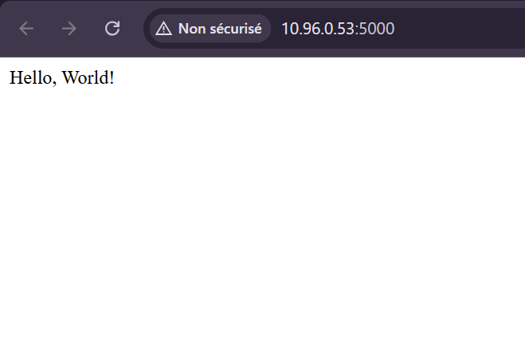

# bus_reseaux


Ceci est le compte-rendu du tp de bus et réseau


[TOC]

------


## 2. TP1- Bus I2C

### 2.1 Capteur BMP280

Mise en œuvre du BMP280 


Toutes les communications avec l'équipement (le capteur I2C) sont réalisées en lisant et en écrivant dans des registres. 

​		--> Ces registres sont sur une largeur de 8 bits et sont décrits dans le tableau suivant. 


| Quelles sont les adresses I²C possibles pour ce composant. | On peut lire en page 28 de la datasheet (link ) que l'équipement possède une adresse sur 7 bits qui est '111011x' . Les 6 premiers bits, ceux de poids fort, sont différents de 'x'. Le caractère 'x' sert à indiquer que le bit de poids faible n'est pas fixé . L'utilisateur doit le fixer et le configurer en l'adressant avec une adresse personalisée. <br/>Pour |
| ---------------------------------------------------------- | ------------------------------------------------------------ |
|                                                            |                                                              |
|                                                            |                                                              |
|                                                            |                                                              |


1. Quelles sont les adresses I²C possibles pour ce composant.

   On peut lire en page 28 de la datasheet (link ) que l'équipement possède une adresse sur 7 bits qui est '111011x' . Les 6 premiers bits, ceux de poids fort, sont différents de 'x'. Le caractère 'x' sert à indiquer que le bit de poids faible n'est pas fixé et que l'utilisateur doit le fixer et le configurer en l'adressant avec une adresse personalisée. 
   Pour 

   

   


| Identifier le registre et la valeur permettant d'identifier ce composant | Le registre d'identification (ID) est à l'adresse 0xD0, et sa valeur est 0x58 pour le BMP280. |
| ------------------------------------------------------------ | ------------------------------------------------------------ |
|                                                              |                                                              |


1. Identifier le registre et la valeur permettant d'identifier ce composant 


Le registre d'identification (ID) est à l'adresse 0xD0, et sa valeur est 0x58 pour le BMP280. 


| Identifier le registre et la valeur permettant de placer le composant en mode normal | Le registre de contrôle ctrl_meas (adresse 0xF4) permet de définir le mode de fonctionnement. Les bits 	mode[1:0] doivent être configurés à 11 pour le mode normal. |
| ------------------------------------------------------------ | ------------------------------------------------------------ |
|                                                              |                                                              |


3. Identifier le registre et la valeur permettant de placer le composant en mode normal 

​	Le registre de contrôle ctrl_meas (adresse 0xF4) permet de définir le mode de fonctionnement. Les bits 	mode[1:0] doivent être configurés à 11 pour le mode normal. 

 

| Identifier les registres contenant l'étalonnage du composant | Les données d'étalonnage sont stockées dans les registres de 0x88 à 0xA1 |
| ------------------------------------------------------------ | ------------------------------------------------------------ |
|                                                              |                                                              |


4. Identifier les registres contenant l'étalonnage du composant 

Les données d'étalonnage sont stockées dans les registres de 0x88 à 0xA1 

 

| Identifier les registres contenant la température (ainsi que le format) | Les données de température sont réparties sur trois registres : 0xFA (MSB), 0xFB (LSB), et 0xFC (XLSB). |
| ------------------------------------------------------------ | ------------------------------------------------------------ |
|                                                              | Le format est une valeur non signée de 20 bits : le MSB contient les bits [19:12], le LSB les bits [11:4], et le XLSB les bits [3:0]. |


5. Identifier les registres contenant la température (ainsi que le format) 

Les données de température sont réparties sur trois registres : 0xFA (MSB), 0xFB (LSB), et 0xFC (XLSB). 

Le format est une valeur non signée de 20 bits : le MSB contient les bits [19:12], le LSB les bits [11:4], et le XLSB les bits [3:0]. 

 

| Identifier les registres contenant la pression (ainsi que le format) | Les données de pression sont également réparties sur trois registres : 0xF7 (MSB), 0xF8 (LSB), et 0xF9 (XLSB). |
| ------------------------------------------------------------ | ------------------------------------------------------------ |
|                                                              | Le format est une valeur non signée de 20 bits, similaire à celui des données de température. |


6. Identifier les registres contenant la pression (ainsi que le format) 

Les données de pression sont également réparties sur trois registres : 0xF7 (MSB), 0xF8 (LSB), et 0xF9 (XLSB). 

Le format est une valeur non signée de 20 bits, similaire à celui des données de température. 

 

| Identifier les fonctions permettant le calcul de la température et de la pression compensées, en format entier 32 bits. | La fonction pour la compensation de la température est bmp280_compensate_T_int32 et celle pour la pression est bmp280_compensate_P_int64. Ces fonctions utilisent des entiers 32 bits pour les calculs de compensation. |
| ------------------------------------------------------------ | ------------------------------------------------------------ |
|                                                              |                                                              |


7. Identifier les fonctions permettant le calcul de la température et de la pression compensées, en format entier 32 bits. 

La fonction pour la compensation de la température est bmp280_compensate_T_int32 et celle pour la pression est bmp280_compensate_P_int64. Ces fonctions utilisent des entiers 32 bits pour les calculs de compensation. 

 

***

***

***


### 2.2. Setup du STM32

La carte utilisée est une : STM32 NUCLEO-F446RE


Il nous faut 


La figure suivante montrent les signaux connectés par défaut aux connecteurs ARDUINO® Uno V3
(CN5, CN6, CN8, CN9) et au connecteur ST morpho (CN7 et CN10), on retrouve une figure pour chaque carte STM32 Nucleo page 35  de la datasheet :

 [user manual : dm00105823-stm32-nucleo64-boards-mb1136-stmicroelectronics.pdf](docs_annexes/datasheet documents/dm00105823-stm32-nucleo64-boards-mb1136-stmicroelectronics.pdf) 


On doit câbler la carte fille qui contient les composants dont le BMP280 . Il faut faire **attention au câblage**  qui a été une source d'erreur et une grande perte de temps.

Le points à contrôler sont : 

-les pins GPIO sur lequels l'i2c est configurée dans l'ioc

-les pins PHYSIQUE sur lesquels on branche SCL cable jaune et SDA cable blanc   : voir la photo

-les pins physiques sur lesquels on branche VCC (sur un pin 3.3V de la nucleo ) c-a-d le câble rouge et GND sur un pin GND de la nucleo


PHOTO du câblage sur la STM32 pour la connection logicielle


image-20241011090144010-I2C : 

​	

​	I2C1_SDA sur PB9 

​	I2C1_SCL sur PB8 


MAJ du tp4 : il faut déplacer l'i2c de ces pins afin de les libérer pour le bus CAN 

| PB7 pour SDA | PB6 pour SCL |
| ------------ | ------------ |


UART 2
	TX sur PA2 et RX  PA3


D'un UART pour la PI0. (TP2)

UART ? : usart 1 PA10 et PA9  

​	PIN 


PHOTO du câblage sur la STM32 pour la connection matérielle :


Les pins PB9 et PB8 se trouvent à droite de la carte en haut comme on peut le voir sur la figure de la carte ci-dessus. 

Attention le pin PB8 commence au deuxième pins sur les connecteurs morpho.

On rappel que le signal SDA sur PB9 et SCL sur PB8.

Tandis quel 3.3 V pour VCC et le GND sont à gauche de la carte( on peut utiliser d'autres GND situé sur la carte qu'à gauche mais visuellement c'est plus pratique pour vérifier le câblage s'ils sont isolé d'un côté et les pins I2C d'un autre).


Pour la partie CAN, on doit utiliser les pins PB8 ET PB9  d'après le sujet de TP, il faudra donc penser à déplacer les connexions pour le CAN sur d'autres pins si on souhaite utiliser PB8 et PB9


D'un CAN 

*****************Problèmes cube ide****************************

```bash
sudo apt-get install libncurses5
Lecture des listes de paquets... Fait
Construction de l'arbre des dépendances... Fait
Lecture des informations d'état... Fait      
Les paquets supplémentaires suivants seront installés : 
  libtinfo5
Les NOUVEAUX paquets suivants seront installés :
  libncurses5 libtinfo5
0 mis à jour, 2 nouvellement installés, 0 à enlever et 6 non mis à jour.
Il est nécessaire de prendre 207 ko dans les archives.
Après cette opération, 883 ko d'espace disque supplémentaires seront utilisés.
Souhaitez-vous continuer ? [O/n] o
Réception de :1 http://fr.archive.ubuntu.com/ubuntu jammy-updates/universe amd64 libtinfo5 amd64 6.3-2ubuntu0.1 [100 kB]
Réception de :2 http://fr.archive.ubuntu.com/ubuntu jammy-updates/universe amd64 libncurses5 amd64 6.3-2ubuntu0.1 [107 kB]
207 ko réceptionnés en 0s (974 ko/s)   
Sélection du paquet libtinfo5:amd64 précédemment désélectionné.
(Lecture de la base de données... 283299 fichiers et répertoires déjà installés.)
Préparation du dépaquetage de .../libtinfo5_6.3-2ubuntu0.1_amd64.deb ...
Dépaquetage de libtinfo5:amd64 (6.3-2ubuntu0.1) ...
Sélection du paquet libncurses5:amd64 précédemment désélectionné.
Préparation du dépaquetage de .../libncurses5_6.3-2ubuntu0.1_amd64.deb ...
Dépaquetage de libncurses5:amd64 (6.3-2ubuntu0.1) ...
Paramétrage de libtinfo5:amd64 (6.3-2ubuntu0.1) ...
Paramétrage de libncurses5:amd64 (6.3-2ubuntu0.1) ...
Traitement des actions différées (« triggers ») pour libc-bin (2.35-0ubuntu3.8) ...

```


*************************************

##### **Redirection du print**

Afin de pouvoir facilement déboguer votre programme STM32, faites en  sorte que la fonction printf renvoie bien ses chaînes de caractères sur  la liaison UART sur USB, en ajoutant le code suivant au fichier  stm32f4xx_hal_msp.c:

```c
/* USER CODE BEGIN PV */
extern UART_HandleTypeDef huart2;
/* USER CODE END PV */
/* USER CODE BEGIN Macro */
#ifdef __GNUC__ /* With GCC/RAISONANCE, small printf (option LD Linker->Libraries->Small printf    set to 'Yes') calls __io_putchar() */
#define PUTCHAR_PROTOTYPE int __io_putchar(int ch)
#else
#define PUTCHAR_PROTOTYPE int fputc(int ch, FILE *f)
#endif /* __GNUC__ */
/* USER CODE END Macro */
/* USER CODE BEGIN 1 */
/**
  * @brief  Retargets the C library printf function to the USART.
  * @param  None
  * @retval None
  */
PUTCHAR_PROTOTYPE
{
  /* Place your implementation of fputc here */
  /* e.g. write a character to the USART2 and Loop until the end of transmission */
  HAL_UART_Transmit(&huart2, (uint8_t *)&ch, 1, 0xFFFF);

  return ch;
}
/* USER CODE END 1 */
```


*********************************************

##### **Test de la chaîne de compilation et communication UART sur USB**

Si `ttyAMA0` est utilisé pour la console système et que vous souhaitez l’utiliser pour votre propre application, vous devrez le libérer 


Utiliser la commande suivante pour lancer `minicom` sur le bon port :

```bash
sudo minicom -D /dev/ttyACM0 # pour la nucleo

minicom -b 115200 -o -D /dev/ttyAMA0 #pour la pi zero
```

Une fois la commande lancé, le code écrit dans le main (la ligne du printf) doit s'afficher dans la commande


L'affichage est décalé car il manquait le \r pour le retour chariot 

```c
printf("Hello from STM32!\r\n");
```

Maintenant l'affichage est centré à gauche comme on peut le voir : 


****

***

***


### 2.3. Communication I²C

On va ajouter tout le code nécessaire pour manipuler le composant dans des fonctions dont la syntaxe pour rédiger leurs signatures sera BMP280_fonction_a_coder(). Elle seront déclarer dans le fichier header BMP280_vincent.h et implémenter dans le fichier qui sera appelé BMP280_vincent.c. 


___

#### Identification du BMP280 : CheckID


On doit vérifier que le contenu du registre correspond bien à la datasheet.

L'identification du BMP280 consiste en la lecture du registre ID.

La première fonction qu'on code  est donc la vérification de l’id de l’équipement I2C . 

On obtient sa réponse avec la fonction hal Receive (). Le buffer passé en argument de cette fonction sera écrasé par les data transmises par le composant I2C.  Ce buffer doit être de type uint8_t sinon les octets transmis ne seront pas bien stockés.

**Nous avons donc implémenté la fonction checkID().** 

**code de la fonction checkID() :** 

```c
int BMP280_checkID(void) {


	//FOnctionnel au 23 oct 18h59 <<<<<<< aussi 9 nov 19h34 organisé

	uint8_t buf[10];
	buf[0]=BMP280_ID_REG;

	retour = HAL_I2C_Master_Transmit(&hi2c1, BMP280_ADDR, buf, 1, -1);

	printf("transmission in progress\r\n");

	if(retour != HAL_OK){

		printf(" \n problem during transmission \r\n");

		return 1;

	}
	else{
		printf("no problem during transmission | transmission complete -> reception in progress\r\n");
	}


	retour = HAL_I2C_Master_Receive(&hi2c1, BMP280_ADDR, buf, 1, -1);
	if(retour != HAL_OK){

		printf(" \n problem during reception I2C\r\n");

		return 1;

	}
	else{

		printf("\n reception complete ...  : Register Id content : 0x%x\r\n", buf[0]);
	}

}
```


***


#### **Configuration du BMP280** 

Avant de pouvoir faire une mesure, il faut configurer le BMP280.

La configuration à mettre en place dans le composant est la suivante: mode normal, Pressure oversampling x16, Temperature oversampling x2

Pour cela il faut écrire les bonnes valeurs dans les bons registres conformément à la datasheet. 

En I²C, l'écriture dans un registre se déroule de la manière suivante:
1. envoyer l'adresse du registre à écrire, suivi de la valeur du registre
2. si on reçoit immédiatement (avec Receive()), la valeur reçu sera la nouvelle valeur du registre

La lecture de la valeur reçu en 2. nous permet de vérifier que la configuration a bien été écrite dans le registre.


Registre concernés pour établir la configuration voulu dans la documentation.


##### mode normal - Pressure oversampling x16 - Temperature oversampling x2 


tous les registres à configurer sont des sous parties du registre **ctrl_meas** : les bits 7 à 5 pOUr l‘oversampling de temperature , 4 à 2 pour l‘oversampling de la pression. 

 il faudra donc modifier les bits de bon poids à l’adresse du registre **ctrl_meas** pour modifier le paramètre voulu (mode power normal, oversampling) mais tous situés à l’adresse 0xF4 

Les paramètres binaires à mettre sont aussi décrits page 25 datasheet pour chaque paramètres d’oversampling et de mode voulu il y a un mot binaire associé 


***


##### Contrôle du mode d'alimentation

ll faut placer le composant en mode normal, les configurations possibles et leurs valeurs binaires associées du registre mode[1:0] sont décrites dans le tableau suivant page 15 : 
  	

| Adresse registre ctrl_meas | Valeur à écrire                                              |
| -------------------------- | ------------------------------------------------------------ |
| 0xF4                       | Les bits mode[1:0] doivent être configurés à 11 pour le mode normal. |


***


On souhaite paramétrer Pressure oversampling à x16 etTemperature oversampling à x2 . 

##### Contrôle de la mesure de pression 

page 12 : Pour activer l’oversampling de la pression (et la mesure) il faut sélectionner les bits [2:0] du registre de control osrs_p à l’adresse 0xF4. Les configurations possibles et valeurs associés du registre osrs_p ne pas sont décrites p.13 dans le tableau ci-dessous.


 Mais dans le tableau 21 ci-dessous les exemples de configuration avec l'oversampling sont détaillés  page25 : 


On va choisir le mot binaire ‘101’ qui correspond à oversampling x16 ce que l’on souhaite comme configuration. 

La valeur '101' à écrire dans le code est notée 0b101. 


##### Contrôle de la mesure de température

Pour activer l’oversampling de la température (et la mesure), il faut sélectionner les bits [2:0] du registre de control osrs_t toujours à l’adresse 0xF4 

Configurations possibles et valeurs possible du registre osrs_t sont tout de suite décrites dans le tableau 5 suivant page 13 :  


Ou dans le tabelau  22 page 25 :


On va choisir le mot binaire ‘010’ qui correspond à oversampling x2, ce que l’on souhaite comme configuration. 

Il faut écrire dans les bits 7 à 5 du registre le mot binaire ’010’ qu’on notera dans le code C “0b010”. 

***

Fin explications de la datasheet

***


On va ajouter tout le code nécessaire pour configurer le composant dans une fonction BMP280_config() qui sera dans le fichier driver.c qui sera accompagné de son fichier driver.h 


En I²C, l'écriture dans un registre se déroule de la manière suivante : 

1. envoyer l'adresse du registre à écrire, suivi de la valeur du registre 
2. si on reçoit immédiatement, la valeur reçu, lorsque l’on essaie de lire le bus, sera la nouvelle valeur du registre 

**************************

Code bpm  


```c
uint8_t config = (0b010<<5)|(0b101<<2)|(0b11);  
```


(0b010<<5)pour remplir les bits [7:5] soit les bit 7 à 5 soit **osrs_t [2:0]** 

**`0b010 << 5`** : 

- `0b010` est `2` en décimal.
- Décalage de 5 bits vers la gauche : `0b01000000`, soit `64` en décimal


(0b101<<2) pour remplir les bits [4:2] (bits 4 à 2) soit **osrs_p [2:0]** 

**`0b101 << 2`** :

- `0b101` est `5` en décimal.
- Décalage de 2 bits vers la gauche : `0b00010100`, soit `20` en décimal.


(0b11) pour remplir les bits [1:0] soit **mode [1:0]** 

**`0b11`** :

- `0b11` est `3` en décimal et n'est pas décalé.


La valeur de `config` est donc **87** en décimal, soit **0x57** en hexadécimal, et **0b01010111** en binaire.


On lit bien sur l'USART la valeur renvoyé par le capteur suite à la configuration, affiché en hexadécimal grâce à %x :


*****

Pour historique/archive

****


****

Screenshot résultat [Dernier test après remis en arrière le code] 


 

```c
void BMP280_config(void) {
	uint8_t part1 = 0b010 << 5;  // Décalage de 5 bits
	uint8_t part2 = 0b101 << 2;  // Décalage de 2 bits
	uint8_t part3 = 0b11;        // Pas de décalage
	printf("Part1 (0b010 << 5) = %u\r\n", part1);   // Affiche 64
	printf("Part2 (0b101 << 2) = %u\r\n", part2);   // Affiche 20
	printf("Part3 (0b11)       = %u\r\n", part3);   // Affiche 3
	uint8_t sumPart=part1+part2+part3;
	printf(" sum of parts = Part1+Part2+Part3 = %u \r\n",sumPart);   // Affiche 3
	uint8_t config = part1 | part2 | part3;


	uint8_t buf[2];


	buf[0] = ctrl_meas;

	buf[1] = config;  //mot binaire a ecrire pour conf correctement 

	retour = HAL_I2C_Master_Transmit(&hi2c1, BMP280_ADDR, buf, 2,HAL_MAX_DELAY);

	printf("configuration : transmission in progress\r\n");

	if (retour != HAL_OK) {

		printf("\n config: problem during transmission \r\n\r\n");

	}

	else{
		printf("config : no problem during transmission ... transmission complete -> reception in progress\r\n");
	}

	retour = HAL_I2C_Master_Receive(&hi2c1, BMP280_ADDR, buf, 1, HAL_MAX_DELAY);

	if (retour != HAL_OK) {

		printf("\n config : problem during reception I2C\r\n");


	}
	//printf("config = %u\r\n",config);
	if (buf[1] == config) {

		printf("\nconfig : well configured - configuration value = hexadecimal : 0x%x | decimal  : 0d%u\r\n", buf[1]);


	}


}
```


**Printf - paramètres :**

utiliser le spécificateur de format %d pour afficher un entier 

**%u** est utilisé pour afficher le contenu de la variable en décimal (entiers non signé) Code b 

**%x** sert à afficher le contenu de la variable en hexadécimal  


___


#### Récupération de l'étalonnage de la température et de la pression 


##### Étalonnage du composant

Pour récupérer les valeurs d’étalonnage, on envoie l’adresse la plus basse du registre des valeurs d’étalonnage et on réceptionne les 24 valeurs d’étalonnage.


page 21 

| Adresse registres étalonnage                 | Valeur à écrire                                              |
| -------------------------------------------- | ------------------------------------------------------------ |
| 0x88[136 en décimal] à 0xA1 [160 en décimal] | Les bits mode[7:0] doivent être configurés à 11 pour le mode normal. |


Code pour l’étallonage 

On va faire une demande  de lecture qui commence avec transmit() puis read().

La lecture se déroule avec l'envoie de l'adresse du registre 0x88 ( qui correspond au registre calib00 de calibration (étalonnage) la plus basse valeur des adresses de registres d'étallonage ) et on reçoit 1 octet correspondant au contenu du registre.

On ajoute la constante dans le fichier BMP280_vincent.h suivante :

```c
typedef uint32_t BMP280_U32_t;
typedef int32_t BMP280_S32_t;
typedef int64_t BMP280_S64_t;

static const uint8_t BMP280_ADDR = 0x77 << 1; // Use 8-bit address
// static const uint8_t BMP280_ADDR = 0x76 << 1; // Use 8-bit address

static const uint8_t BMP280_ID_REG = 0xD0;//id du registre selon la doc

static const uint8_t BMP280_TRIM_REG_MSB = 0x88;
```

La fonction BMP280_calib() contient le code suivant pour avoir les registres d'étallonage : 

```c
void BMP280_calib(void) {
	//**********à supprimer

	// uint8_t etalo = 0x88; //Adresse du premier registre contenant les valeurs d'étalonnage
	//buf_adr[0]=etalo; //buffer contenant l'adresse du registre d'étalonnage

	//**********************

	uint8_t buf_data[24];	//buffer pour les données reçues des registre

	//on demande la lecture avec le transmit

	//BMP280_TRIM_REG_MSB  est déclarée dans BMP280_vincent.h

	// l'adresse de la variable BMP280_TRIM_REG_MSB est passée a la fonction qui attends une adresse en paramètre (celle sur laquelle pointerait le pointeur pData)
	retour = HAL_I2C_Master_Transmit(&hi2c1, BMP280_ADDR, &BMP280_TRIM_REG_MSB,1, HAL_MAX_DELAY);

	if (retour != HAL_OK) {
		printf("Probleme calib I2C\r\n");
		return;
	}
	//on lit la réponse qu'on stocke dans le buffer buf_data
	retour = HAL_I2C_Master_Receive(&hi2c1, BMP280_ADDR, buf_data, 24,HAL_MAX_DELAY);

	if (retour != HAL_OK) {
		printf("Problem calib I2C\r\n");;


	}
	else {	//on affiche les données d'étallonage reçues

	}
	dig_T1 = buf_data[0] | (buf_data[1] << 8);
	dig_T2 = buf_data[2] | (buf_data[3] << 8);
	dig_T3 = buf_data[4] | (buf_data[5] << 8);
	dig_P1 = buf_data[6] | (buf_data[7] << 8);
	dig_P2 = buf_data[8] | (buf_data[9] << 8);
	dig_P3 = buf_data[10] | (buf_data[11] << 8);
	dig_P4 = buf_data[12] | (buf_data[13] << 8);
	dig_P5 = buf_data[14] | (buf_data[15] << 8);
	dig_P6 = buf_data[16] | (buf_data[17] << 8);
	dig_P7 = buf_data[18] | (buf_data[19] << 8);
	dig_P8 = buf_data[20] | (buf_data[21] << 8);
	dig_P9 = buf_data[22] | (buf_data[23] << 8);
	for (int i = 0; i < 24; i++) {
		printf("\ni :%d\r\n",i);
		printf("dans boucle for //registre d'etallonage calib= %d \r\n ", buf_data[i]);


	}
	
}
```


```c
#include "stdio.h"
#include "stdlib.h"

#include "main.h"
#include "BMP280_vincent.h"

extern I2C_HandleTypeDef hi2c1;

uint16_t dig_T1;
int16_t dig_T2;
int16_t dig_T3;
uint16_t dig_P1;
int16_t dig_P2;
int16_t dig_P3;
int16_t dig_P4;
int16_t dig_P5;
int16_t dig_P6;
int16_t dig_P7;
int16_t dig_P8;
int16_t dig_P9;
  

  
 
  //envoyer une trame avec l'adresse du registre à l'aide de la fonction HAL_I2C_Master_Transmit().
  //buf[0]=BMP_ID_REG;
  //HAL_I2C_Master_Transmit(&hi2c1, BMP280_ADDR, buf, 1, -1);

  //HAL_I2C_Master_Receive(&hi2c1, BMP280_ADDR, buf, 1, -1);
  //printf("Idreg: 0x%x\r\n", buf[0]); 
  
 int BMP280_checkID(void){ 

    uint8_t buffer[1]; 
	buf[0] = BMP280_ID_REG;
    retour = HAL_I2C_Master_Transmit(&hi2c1,BMP280_ADDR, &ID_address, 1, HAL_MAX_DELAY); 

    if(retour != HAL_OK){ 

        printf("Problème avec l'I2C\r\n"); 

        return 1; 

    } 

    retour = HAL_I2C_Master_Receive(&hi2c1, BMP280_ADDR, buffer, 1, HAL_MAX_DELAY); 

    if(retour != HAL_OK){ 

        printf("Problème avec l'I2C\r\n"); 

        return 1; 

    } 

    printf("L'ID du capteur est 0x%x\r\n",buffer[0]); 

    return 0; 

} 		 
  
 int BMP280_config(void){ 

    //uint8_t buffer[1]; 

    uint8_t buf[2]; 

    buf[0]= ctrl_meas; 

    buf[1]= config;//mot binaire a ecrire pour conf correctement 

    retour = HAL_I2C_Master_Transmit(&hi2c1,BMP280_ADDR, buf, 2, HAL_MAX_DELAY); 

    if(retour != HAL_OK){ 

        printf("Problème avec l'envoie I2C\r\n"); 

        return 1; 

    } <

    retour = HAL_I2C_Master_Receive(&hi2c1, BMP280_ADDR, buf, 1, HAL_MAX_DELAY); 

    if(retour != HAL_OK){ 

        printf("Problème avec la lecture I2C\r\n"); 

        return 1; 

    } 

 

    if(buffer[0] == config){ 

        printf("La config reçue est bien reçue et elle vaut %d\r\n", buffer[0]); 

        return 0; 

    } 

    return 0; 

}

 void BMP280_calib(void){
	//**********à supprimer

	// uint8_t etalo = 0x88; //Adresse du premier registre contenant les valeurs d'étalonnage
	//buf_adr[0]=etalo; //buffer contenant l'adresse du registre d'étalonnage

	//**********************

	 buf_data[24];//buffer pour les données reçues des registre

	 //on demande la lecture avec le transmit

	 //BMP280_TRIM_REG_MSB  est déclarée dans BMP280_vincent.h

	 // l'adresse de la variable BMP280_TRIM_REG_MSB est passée a la fonction qui atteint une adresse en paramètre (celle sur laquelle pointerait le pointeur pData)
	 retour=HAL_I2C_Master_Transmit(&hi2c1,BMP280_address,&BMP280_TRIM_REG_MSB,1, HAL_MAX_DELAY);

	 if(retour != HAL_OK){
	 		printf("Problème avec le transmit() del'I2C\r\n");
	 	}
	 //on lit la réponse qu'on stocke dans le buffer buf_data
	 retour = HAL_I2C_Master_Receive(&hi2c1,BMP280_address, buf_data, 24, HAL_MAX_DELAY);

	   if(retour != HAL_OK){

	 ​    printf("Problème avec la lecture des données d’étallonage I2C \r\n");

	 ​    return 1;
	   }
	   else{//on affiche les données d'étallonage reçues

		   for(int i=0; i<25; i++){
			   printf("registre d'étallonage calib [%d] \r\n ",buf_	data[i]);

		   }
	   }
	   dig_T1 = buf_data[0]|(buf_data[1]<<8);
	   dig_T2 = buf_data[2]|(buf_data[3]<<8);
	   dig_T3 = buf_data[4]|(buf_data[5]<<8);
	   dig_P1 = buf_data[6]|(buf_data[7]<<8);
	   dig_P2 = buf_data[8]|(buf_data[9]<<8);
	   dig_P3 = buf_data[10]|(buf_data[11]<<8);
	   dig_P4 = buf_data[12]|(buf_data[13]<<8);
	   dig_P5 = buf_data[14]|(buf_data[15]<<8);
	   dig_P6 = buf_data[16]|(buf_data[17]<<8);
	   dig_P7 = buf_data[18]|(buf_data[19]<<8);
	   dig_P8 = buf_data[20]|(buf_data[21]<<8);
	   dig_P9 = buf_data[22]|(buf_data[23]<<8);
 }

 BMP280_get_temperature(){

}

```


il faut décaler l'octet écrit qui est de poids fort (c-a-d le deuxième octet reçu dans chaque couple d'octet par exemple pour buf_data[1] et buf_data[0] c'est buf_data[1] qui est l'octet de poids fort) dans chaque registre de calibration pour les stockés dans les variables t1,t2,t3,p1,...

```c
dig_T1 = buf_data[0]|(buf_data[1]<<8<<8);
```

On met sur 16 bit, soit 2 octets, l'octet contenu dans buf_data[1] alors qu'il était sur 1 octet auparavant. 

```
 (buf_data[1]<<8);
```

Cela nous permettra de faire un 'OU' logique avec l'autre octet  non décalé (buf_data[0]). L'octet de buf_data[0] sera convertit sur 16 bits en plaçant un octet de '0' en octet de poids fort (MSB) devant l'octet de donnée contenu dans buf_data[0]

exemple : 

0x0034 est égal à 0x34 sauf que l'on précise dans la première forme qu'il y a un octet de 0 à écrire avant d'écrire les bits en base 2 de 0x34.

**Valeur de `buf_data[0]` (LSB)** :

- 00000000 00110100 (0x0034)


Et vu que tout l'octet de buf_data[1] a été décalé vers le MSB. Il restera l'octet de poids fort une fois le 'OU' effectué .

Ainsi tout le contenu écrit dans buf_data [1] soit un octet entier sera simplement recopié lors de l'opération logique . 

On fait pareil pour chaque registre, on stocke dans un variable une fois le décalage fait.

```c
	   dig_T1 = buf_data[0]|(buf_data[1]<<8);
	   dig_T2 = buf_data[2]|(buf_data[3]<<8);
	   dig_T3 = buf_data[4]|(buf_data[5]<<8);
	   dig_P1 = buf_data[6]|(buf_data[7]<<8);
	   dig_P2 = buf_data[8]|(buf_data[9]<<8);
	   dig_P3 = buf_data[10]|(buf_data[11]<<8);
	   dig_P4 = buf_data[12]|(buf_data[13]<<8);
	   dig_P5 = buf_data[14]|(buf_data[15]<<8);
	   dig_P6 = buf_data[16]|(buf_data[17]<<8);
	   dig_P7 = buf_data[18]|(buf_data[19]<<8);
	   dig_P8 = buf_data[20]|(buf_data[21]<<8);
	   dig_P9 = buf_data[22]|(buf_data[23]<<8);
```


****


##### Récupération de la température et de la pression 


Récupération de la température

On va coder une fonction qui va renvoyer le type  BMP280_S32_t. Pour cela, on va définir ce type dans le .h

```c
typedef int32_t BMP280_S32_t;
```

 Ainsi que l'adresse du registre contenant la température et pression 

```c
static const uint8_t BMP280_TEMP_REG_MSB = 0xFA;//Adresse du registre contenant la température
static const uint8_t BMP280_PRES_REG_MSB = 0xF7;//Adresse du registre contenant la pression
```


**<u>Il faut recevoir la température dans un buffer de type `uint8_t` et `int` sinon on obtiens des valeurs températures incorrectes</u>**


-> Comme on le voir ici  avant compensation on a 3422552063 comme valeur de température et 3456106495 comme valeur de pression


```c
BMP280_S32_t BMP280_get_temperature() {

	BMP280_S32_t adc_T;

	//buffer pour les données reçues de la part des registres , ici 3 pour la température

	///uint8_t ! pas int! : valeur mal stockée = valeur pression incorrecte
	uint8_t buf_data[3];

	//on demande la lecture avec le transmit

	//BMP280_TEMP_REG_MSB   est déclarée dans BMP280_vincent.h

	// l'adresse de la variable BMP280_TEMP_REG_MSB  est passée a la fonction qui attend une adresse en paramètre (celle sur laquelle pointerait le pointeur pData)
	retour = HAL_I2C_Master_Transmit(&hi2c1, BMP280_ADDR, &BMP280_TEMP_REG_MSB, 1,
			HAL_MAX_DELAY);

	if (retour != HAL_OK) {
		printf("Probleme I2C\r\n");
	}
	//on lit la réponse qu'on stocke dans le buffer buf_data
	retour = HAL_I2C_Master_Receive(&hi2c1, BMP280_ADDR, buf_data, 3,HAL_MAX_DELAY);

	if (retour != HAL_OK) {

		printf("problem i2c");

		return 1;
	}

	adc_T = ((BMP280_S32_t) (buf_data[0]) << 12)| ( (BMP280_S32_t) (buf_data[1]) << 4)| ( (BMP280_S32_t) (buf_data[2]) >> 4);
	printf("Temperature adc_T: 0d ");


	//printf("%05lX", adc_T);

	printf("%d \r\n", adc_T);

	return adc_T;
}
```


```c
BMP280_S32_t BMP280_get_pressure() {

	BMP280_S32_t adc_P;


	//uint8_t ! pas int!. Si int buf_data[3] :  valeur mal stockée = valeur pression incorrecte
	uint8_t buf_data[3];//buffer pour 	les données reçues de la part des registres , ici 3 pour la pression

	//on demande la lecture avec le transmit

	//BMP280_PRES_REG_MSB est déclarée dans BMP280_vincent.h

	// l'adresse de la variable BMP280_PRES_REG_MSB est passée a la fonction qui attend une adresse en paramètre (celle sur laquelle pointerait le pointeur pData)
	retour = HAL_I2C_Master_Transmit(&hi2c1, BMP280_ADDR, &BMP280_PRES_REG_MSB, 1,HAL_MAX_DELAY);

	if (retour != HAL_OK) {
		printf("problem i2c\r\n");
	}
	//on lit la réponse qu'on stocke dans le buffer buf_data
	retour = HAL_I2C_Master_Receive(&hi2c1, BMP280_ADDR, buf_data, 3,HAL_MAX_DELAY);

	if (retour != HAL_OK) {

		printf("problem i2c \r\n");

		return 1;
	}

	adc_P = ((BMP280_S32_t) (buf_data[0]) << 12) | ((BMP280_S32_t) (buf_data[1]) << 4) | ((BMP280_S32_t) (buf_data[2]) >> 4);

	printf("Pressure adc_P:    0d ");


	//printf("%05lX", adc_P);

	printf("%d\r\n", adc_P);


	return adc_P;
}
```


***


#### Calcul des températures et des pression compensées

On utilise le code mis à disposition par bosch dans la datasheet que l'on ajoute dans le fichier BMP280_vincent.c

Juste avant dans le fichier .h on déclare les types nécessaire au retour de ces fonctions et on déclare les fonctions : 

```c
BMP280_S32_t bmp280_compensate_T_int32(BMP280_S32_t adc_T)
```

Et on déclare ces fonctions : 

```c
//déclarations fonctions de compensation de bosch
BMP280_S32_t bmp280_compensate_T_int32(BMP280_S32_t );
BMP280_U32_t bmp280_compensate_P_int64(BMP280_S32_t);
```

Il faut modifier dans le corps des fonctions les signes tiret longs "–" (ou dash) par des tirets court classique  pour que le compilateur reconnaisse l'opération de soustraction "-"


Fonction de compensation de la température :

```c
// Returns temperature in DegC, resolution is 0.01 DegC. Output value of “5123” equals 51.23 DegC.
// t_fine carries fine temperature as global value
BMP280_S32_t t_fine;
BMP280_S32_t bmp280_compensate_T_int32(BMP280_S32_t adc_T)
{
BMP280_S32_t var1, var2, T;
var1 = ((((adc_T>>3) - ((BMP280_S32_t)dig_T1<<1))) * ((BMP280_S32_t)dig_T2)) >> 11;
var2 = (((((adc_T>>4) - ((BMP280_S32_t)dig_T1)) * ((adc_T>>4) - ((BMP280_S32_t)dig_T1))) >> 12) *((BMP280_S32_t)dig_T3)) >> 14;
t_fine = var1 + var2;
T = (t_fine * 5 + 128) >> 8;
return T;
}

```


Fonction de compensation de la pression :


```c
// Returns pressure in Pa as unsigned 32 bit integer in Q24.8 format (24 integer bits and 8 fractional bits).
// Output value of “24674867” represents 24674867/256 = 96386.2 Pa = 963.862 hPa


BMP280_U32_t bmp280_compensate_P_int64(BMP280_S32_t adc_P)
{
	BMP280_S64_t var1, var2, p;
	var1 = ((BMP280_S64_t)t_fine) - 128000;
	var2 = var1 * var1 * (BMP280_S64_t)dig_P6;
	var2 = var2 + ((var1*(BMP280_S64_t)dig_P5)<<17);
	var2 = var2 + (((BMP280_S64_t)dig_P4)<<35);
	var1 = ((var1 * var1 * (BMP280_S64_t)dig_P3)>>8) + ((var1 * (BMP280_S64_t)dig_P2)<<12);
	var1 = (((((BMP280_S64_t)1)<<47)+var1))*((BMP280_S64_t)dig_P1)>>33;
	if (var1 == 0)
	{
		return 0; // avoid exception caused by division by zero
	}
	p = 1048576-adc_P;
	p = (((p<<31)-var2)*3125)/var1;
	var1 = (((BMP280_S64_t)dig_P9) * (p>>13) * (p>>13)) >> 25;
	var2 = (((BMP280_S64_t)dig_P8) * p) >> 19;
	p = ((p + var1 + var2) >> 8) + (((BMP280_S64_t)dig_P7)<<4);
	return (BMP280_U32_t)p;
}

```


***

***

***


```C
/ Returns temperature in DegC, resolution is 0.01 DegC. Output value of “5123” equals 51.23 DegC.
// t_fine carries fine temperature as global value
BMP280_S32_t t_fine;
BMP280_S32_t bmp280_compensate_T_int32(BMP280_S32_t adc_T)
{
BMP280_S32_t var1, var2, T;
var1 = ((((adc_T>>3) – ((BMP280_S32_t)dig_T1<<1))) * ((BMP280_S32_t)dig_T2)) >> 11;
var2 = (((((adc_T>>4) – ((BMP280_S32_t)dig_T1)) * ((adc_T>>4) – ((BMP280_S32_t)dig_T1))) >> 12) *
((BMP280_S32_t)dig_T3)) >> 14;
t_fine = var1 + var2;
T = (t_fine * 5 + 128) >> 8;
return T;
}
“”–
// Returns pressure in Pa as unsigned 32 bit integer in Q24.8 format (24 integer bits and 8 fractional bits).
// Output value of “24674867” represents 24674867/256 = 96386.2 Pa = 963.862 hPa
BMP280_U32_t bmp280_compensate_P_int64(BMP280_S32_t adc_P)
{
BMP280_S64_t var1, var2, p;
var1 = ((BMP280_S64_t)t_fine) – 128000;
var2 = var1 * var1 * (BMP280_S64_t)dig_P6;
var2 = var2 + ((var1*(BMP280_S64_t)dig_P5)<<17);
var2 = var2 + (((BMP280_S64_t)dig_P4)<<35);
var1 = ((var1 * var1 * (BMP280_S64_t)dig_P3)>>8) + ((var1 * (BMP280_S64_t)dig_P2)<<12);
var1 = (((((BMP280_S64_t)1)<<47)+var1))*((BMP280_S64_t)dig_P1)>>33;
if (var1 == 0)
{
return 0; // avoid exception caused by division by zero
}
p = 1048576-adc_P;
p = (((p<<31)-var2)*3125)/var1;
var1 = (((BMP280_S64_t)dig_P9) * (p>>13) * (p>>13)) >> 25;
var2 = (((BMP280_S64_t)dig_P8) * p) >> 19;
p = ((p + var1 + var2) >> 8) + (((BMP280_S64_t)dig_P7)<<4);
return (BMP280_U32_t)p;
```

Lors de l'appel de ces fonctions il faudra passer les variables adc_T et adc_P en argument pour recevoir les valeurs compensées retournées par la fonction 


**Dans la boucle infinie du STM32,  récupérez les valeurs de la température et de la pression. Envoyez sur  le port série le valeurs 32 bit non compensées de la pression de la  température.** 

On appelle les fonctions dans la boucle while dans le fichier main.c 

```c
//dans la boucle while
*************************************************
BMP280_S32_t temp_uncompen;
BMP280_S32_t pres_uncompen;

temp_uncompen= BMP280_get_temperature();//récupérer la température
pres_uncompen=BMP280_get_pressure()//récupérer la pression

printf("valeur non compensée de la température %d \n\ valeur non compensée de la pression %d",temp_uncompen,pres_uncompen);

HAL_Delay(1000);

**************************************************
//aperçu de la boucle while du main.c
  /* Infinite loop */
  /* USER CODE BEGIN WHILE */
  while (1)
  {
	  BMP280_S32_t temp_uncompen;
	  BMP280_S32_t pres_uncompen;

	  temp_uncompen= BMP280_get_temperature(); //récupérer la température
	  pres_uncompen=BMP280_get_pressure(); //récupérer la pression

	  printf("valeur non compensée de la température %d \n\ valeur non compensée de la pression %d",temp_uncompen,pres_uncompen);

	  HAL_Delay(1000);
    /* USER CODE END WHILE */

    /* USER CODE BEGIN 3 */
  }
  /* USER CODE END 3 */
}


```


****


****

La température est renvoyée en **dixièmes de degré Celsius**, avec une **résolution de 0.01°C**. Vous avez mentionné qu'un **valeur de 5123** correspond à **51.23°C**.

#### Formatage de la température  et de la pression [compensée] :

Si la température compensée est de **2545**, cela signifie que :

Tempeˊrature compenseˊe en °C=2545100=25.45 °C\text{Température compensée en °C} = \frac{2545}{100} = 25.45 \, \text{°C}Tempeˊrature compenseˊe en °C=1002545=25.45°C

Donc, la température compensée serait ***<u>25.45°C</u>***.


******


La pression est renvoyée en **format Q24.8**, où les 24 bits représentent la partie entière de la pression et les 8 bits représentent la partie fractionnaire. 

Ainsi, la pression compensée est donnée sous la forme **P / 256**, où **P** est l'entier brut en **Pa**. 

la doc a mentionné qu'une valeur de **24674867** correspond à une pression de **963.86 hPa**.

Si la pression compensée est de **34601705** (en Pa), cela représente une valeur en **format Q24.8**. Pour obtenir la pression en **hPa**, nous devons diviser par 256 :

Pression compenseˊe en Pa=34601705256=135492.82 Pa\text{Pression compensée en Pa} = \frac{34601705}{256} = 135492.82 \, \text{Pa}Pression compenseˊe en Pa=25634601705=135492.82Pa = 1.3 bar environ c'est cohérent 

Ensuite, pour convertir la pression en **hPa** (hectopascals), nous divisons par 100 :

Pression compenseˊe en hPa=135492.82100=1354.93 hPa\text{Pression compensée en hPa} = \frac{135492.82}{100} = 1354.93 \, \text{hPa}Pression compenseˊe en hPa=100135492.82=1354.93hPa

Donc, la pression compensée serait **<u>*1354.93 hPa*</u>**.


Passé les pression en bar 


****

****

****

****


20 nov 2024


## 3. TP2 - Interfaçage STM32 - Raspberry

### 3.1. Mise en route du Raspberry PI Zéro

#### Premier démarrage

on flash la carte pour installer pi os lite 32 bits avec l'outil pi imager en précisant comme user (pi0) et comme mdp (password).

Pour le réseau, on configure ESE_Bus_Network pour le ssid et ilovelinux pour le mdp.
L'adresse IP est attribuée par le routeur : 192.168.88.237.

 231 disparue 

****

carte sd de vincent 

nom d'hote:  vkpi


user : vkuser

mot de passe : mdp 


Réseau 

ssid: IPhone de vincent

mot de passe : mdp


makerspace wifi :

user : vkuser

mdp: mdp


Modification de la configuration réseau de la PI zero :

Afin de pouvoir me connecter en ssh sur mon réseau privé au lieu du réseau de la salle de TP, je ajouter le réseau dans le fichier `wpa_supplicant.conf` qui se trouve dans `rootfs/etc/wpa_supplicant` . Pour cela, je monte la carte sd sur ma machine linux pour accèder à la partition boot qui contient ce fichier 

Une fois monté, deux partitions apparaissent : 

- rootfs
- bootfs 

On peut soit uiliser l'interface graphique de l'explorateur de fichier qui va se charger de monter le volume dès que l'on clique sur la partition soit utiliser la commande mount 

```bash
mount	
```


La partition rootfs contient toute l'arborescence (à partir de sa racine \ ), du système (raspbian en l'occurence).


Je ne peux pas ouvrir ce fichier sans sudo, grâce à Gedit je trouve le chemin complet depuis ma machine du fichier à ouvrir:


Lorsque l'on monte une partition, elle est monté à partir du répertoire `/media/vincent/` comme on peut le voir en haut de la fenêtre.


J'ouvre en mode édition le fichier avec la commande

`sudo nano /media/vincent/bootfs/etc/wpa_supplicant/wpa_supplicant.conf`

J'écris dans le fichier les lignes suivantes :

```shell
update_config=1

#Ajout du réseau LAN pocket wifi
network={
 ssid="AIRBOX-69AE"
 psk="6wRp2Fr366H4"
}


```


dans bootfs je créé un fichier ssh vide et je copie le fichier wpa_supplicant.conf et j

```bash
vincent@Warhawk:/media/vincent/bootfs$ touch ssh
vincent@Warhawk:/media/vincent/bootfs$ sudo nano /media/vincent/rootfs/etc/wpa_supplicant/wpa_supplicant.conf
[sudo] Mot de passe de vincent : 
vincent@Warhawk:/media/vincent/bootfs$ pwd
/media/vincent/bootfs
vincent@Warhawk:/media/vincent/bootfs$ sudo cp /media/vincent/rootfs/etc/wpa_supplicant/wpa_supplicant.conf /media/vincent/bootfs

```


***

Dans cmdline.txt, j'ajoute modules-load=dwc2,g_ether et je change regdom par FR


fichier cmdline.txt

```bash
console=tty1 root=PARTUUID=31903f62-02 rootfstype=ext4 fsck.repair=yes rootwait modules-load=dwc2,gether cfg80211.ieee80211_regdom=FR
```


fichier config.txt

```bash
//contenu du fichier config.txt


#ajout à la fin dernière ligne 
dtoverlay=dwc2

```


voir les nouveaux périphériques détectés :


```bash
dmesg | tail -n 20
```


D'après les messages `dmesg`, la Raspberry Pi Zero est détectée comme un périphérique USB Ethernet sous le nom **`enx02dae9f2d112`** (renommée automatiquement à partir de `usb0`). 

Cela indique qu'une i**nterface réseau** a bien été créée pour la Raspberry Pi sur mon ordinateur, mais elle utilise le nom **`enx02dae9f2d112`** au lieu de `usb0`

ip a pour voir le détail des interfaces réseau (l'usb ethernet devrait y figurer)


***


Exécution de la commande suivante pour voir si une adresse IP est assignée à **`enx02dae9f2d112`** :

```bash
ip a show enx02dae9f2d112

```


L'interface réseau usb0 n'a pas d'ip, je vais lui fixer l'ip 169.254.100.1

```bash
sudo ip addr add 169.254.100.1/16 dev enx02dae9f2d112

```

on observe que l'interface a bien récupérée son ip avec la commande `ip a`:


***


POur se connecter en ssh :

```bash
ssh pi0@192.168.1.150
```

****

***


copier boot fs sur la 64 go a moi 

sudo dump -0u -f /dev/sdc1 /dev/sda1


copier rootfs 
sudo dump -0u -f /dev/sdc2 /dev/sda2


**Cloner la carte SD avec `dd` :** Utilisez la commande `dd` pour copier le contenu de la carte SD de 32 Go sur celle de 64 Go. Voici la commande de base pour cela :

```bash
sudo dd if=/dev/sda of=/dev/sdc bs=4M status=progress

```

`if=/dev/sda` : spécifie la carte SD source.

`of=/dev/sdc` : spécifie la carte SD destination.

`bs=4M` : définit la taille du bloc de lecture/écriture à 4 Mo pour une copie plus rapide.

`status=progress` : affiche la progression de la commande `dd`.


led pi zero informations 

| Nombre de clignotements | Signification de l'erreur                                    |
| ----------------------- | ------------------------------------------------------------ |
| **3 clignotements**     | Erreur de démarrage : le fichier `boot.img` est introuvable. |
| **4 clignotements**     | Erreur de démarrage : `start.elf` est introuvable.           |
| **7 clignotements**     | Kernel introuvable (`kernel.img`).                           |
| **8 clignotements**     | Erreur de mémoire SDRAM (souvent lié à une incompatibilité de matériel). |

### 

**Clignotements réguliers** : Fonctionnement normal, la Pi accède à la carte SD.

**Clignotements spécifiques (ex. 4 ou 7)** : Erreurs de démarrage liées aux fichiers de démarrage.

**LED fixe ou éteinte** : Problème d'alimentation, carte SD absente ou image corrompue.


***


### 3.2 Port série 

####  Loopback

On modifie les fichiers suivant pour pouvoir accèder à ce port série sur la pi zero :

-/boot/firmware/config.txt 
Pour activer le port série sur connecteur GPIO, sur la partition boot, modifiez le fichier config.txt pour ajouter à la fin les lignes suivantes:

```txt
enable_uart=1
dtoverlay=disable-bt
```

-/boot/firmware/cmdline.txt

```
console=serial0,115200
```

dans minicom il faut configurer les paramètre suivants en appuyant sur ctrl+A puis O


​							Serial port setup>F - Hardware Flow Control : no> il faut appuyer sur la touche F


Puis appuyer sur ctrl+A puis Z


Il faut appuyer sur E pour activer le local Echo on/off, ainsi lorsque l'on appuyer sur une touche elle est automatiquement renvoyé dans le terminal à la suite du caractère qu'on vient de taper comme montré ci-dessous dans la figure 'loopback test'


​											figure loopback test

Par exemple, en tapant t il se réaffiche grâce au echo qui affiche les caractères du rx sur le terminal.


******


#### Communication avec la STM32	


Attention au cablâge , il  faut  câbler sur pa10 et pa9 et


La pi zero est branché sur les pins PA10 et PA9 de la pi zero (avec le GND).


 pa2 mais sur pc10 et pc11

On a besoin d'un autre port UART, nous avons activé l'UART1 :

pin PC11 USART3_RX

pin PC10 USART3_TX

~~pin PC5 USART3_RX~~

~~pin PB10 USART3_TX~~


Afin de pouvoir facilement déboguer votre programme STM32, faites en  sorte que la fonction printf renvoie bien ses chaînes de caractères sur  la liaison UART (usart 2 ) sur USB, en ajoutant le code suivant au fichier  stm32f4xx_hal_msp.c. On va modifier la fonction **printf** pour quelle affiche sur les 2 ports série en même temps. On part de code : 

```c
/* USER CODE BEGIN PV */
extern UART_HandleTypeDef huart2;
/* USER CODE END PV */
/* USER CODE BEGIN Macro */
#ifdef __GNUC__ /* With GCC/RAISONANCE, small printf (option LD Linker->Libraries->Small printf    set to 'Yes') calls __io_putchar() */
#define PUTCHAR_PROTOTYPE int __io_putchar(int ch)
#else
#define PUTCHAR_PROTOTYPE int fputc(int ch, FILE *f)
#endif /* __GNUC__ */
/* USER CODE END Macro */
/* USER CODE BEGIN 1 */
/**
  * @brief  Retargets the C library printf function to the USART.
  * @param  None
  * @retval None
  */
PUTCHAR_PROTOTYPE
{
  /* Place your implementation of fputc here */
  /* e.g. write a character to the USART2 and Loop until the end of transmission */
  HAL_UART_Transmit(&huart2, (uint8_t *)&ch, 1, 0xFFFF);

  return ch;
}
/* USER CODE END 1 */
```

On ajoute également la transmission vers l'usart3 pour assurer la redirection du printf dans la console de l'USART3.

On rajoute l'écriture dans l'USART3 avec la fonction Transmit dans stm32f4xx_hal_msp.c:

```c
  HAL_UART_Transmit(&huart3, (uint8_t *)&ch, 1, 0xFFFF);
```


Ce qui donne le code suivant pour la fonction printf

```c
PUTCHAR_PROTOTYPE
{
  /* Place your implementation of fputc here */
  /* e.g. write a character to the USART2 and Loop until the end of transmission */
  HAL_UART_Transmit(&huart2, (uint8_t *)&ch, 1, 0xFFFF);
  HAL_UART_Transmit(&huart3, (uint8_t *)&ch, 1, 0xFFFF);
  return ch;
}
```


##### Activation de l'usart dans la PI ZERO

On active l'usart dans la PI ZERO : `sudo raspi-config` > advanced options>seiral port activate


Communication entre la PI zero et le STM32

Le protocole de communication entre le Raspberry et la STM32 est le suivant:

| Requête ds résuu RPi | Réponse du STM | Commentaire                             |
| -------------------- | -------------- | --------------------------------------- |
| GET_T                | T=+12.50_C     | Température compensée sur 10 caractères |
| GET_P                | P=102300Pa     | Pression compensée sur 10 caractères    |
| SET_K=1234           | SET_K=OK       | Fixe le coefficient K (en 1/100e)       |
| GET_K                | K=12.34000     | Coefficient K sur 10 caractères         |
| GET_A                | A=125.7000     | Angle sur 10 caractères                 |

Pour écrire ce protocole on va écrire une fonction void HAL_UART_RxCpltCallback(UART_HandleTypeDef *huart) dans BMP280_vincent.c. 

On va aussi déclarer en variable globale :

```c
***********************************
    // Définir des constantes pour les commandes
#define GET_T 0
#define GET_P 1
#define SET_K 2
#define GET_K 3
#define GET_A 4
#define UNKNOWN 5

uint8_t RxBuff[RX_BUFF_SIZE] = {0};
int K_pid = 0;
uint32_t coef;
BMP280_S32_t temp_uncompen;
BMP280_S32_t pres_uncompen;

// Fonction pour obtenir le code de commande
int getRequestCode(const char* request_pi) {
    if (strcmp(request_pi, "GET_T") == 0) return GET_T;
    else if (strcmp(request_pi, "GET_P") == 0) return GET_P;
    else if (strncmp(request_pi, "SET_K=", 6) == 0) return SET_K; //strncmp(RxBuff, "SET_K=", 6) pour vérifier que les 6 premiers caractères de la chaîne reçue correspondent bien à "SET_K=".
    //Si la commande est correcte, il suffit de prendre le reste de la chaîne, après ces 6 caractères, pour obtenir la valeur numérique.Vous pouvez utiliser atoi() (convertit une chaîne en entier) pour transformer cette partie de la chaîne en un entier.
Vous pouvez utiliser atoi() (convertit une chaîne en entier) pour transformer cette partie de la chaîne en un entier.
    else if (strcmp(request_pi, "GET_K") == 0) return GET_K;
    else if (strcmp(request_pi, "GET_A") == 0) return GET_A;
    return UNKNOWN;
}

```

la taille du tableau qui reçoit les données de l'UART est définit dans le fichier BMP280_vincent.h

```c
#define RX_BUFF_SIZE 5
```


Switch  case étape par étape


```c
void HAL_UART_RxCpltCallback(UART_HandleTypeDef *huart)
{
    int rq_pi=0; 
    switch(rq_pi)t{
        case GET_T: {
        temp_uncompen= BMP280_get_temperature(); //récupérer la température
		temp_comp=bmp280_compensate_T_int32(temp_uncompen); //récupérer la température

		//Si on souhaite affiché la température décommenter la suiteet changer le handle dans le usart transmit 
		//printf("valeur non compensée de la température %u \r\n",temp_uncompen);
		//printf("la température compensée %u \r\n",temp_comp);
		
          
            
        }
            
            
            
    }

```


Switch version g

```c
void dial_pi(){

	if(strcmp(RxBuff,'GET_T')==0) {


		//déclaration des variables contenant la température non compensée
		temp_uncompen= BMP280_get_temperature(); //récupérer la température

		//déclaration des variables contenant la température  compensée
		BMP280_U32_t temp_comp;


		temp_uncompen= BMP280_get_temperature(); //récupérer la température

		temp_comp=bmp280_compensate_T_int32(temp_uncompen); //récupérer la température compensé

		printf("%u \r\n",temp_comp);// AFFICHÉ TEMPÉRATURE compensée sur l'usart

		//T=+12.50_C 	Température compensée sur 10 cafficher aractères
		//GET_P 	P=102300Pa

	}

	if (strcmp(RxBuff,'GET_P')==0){

		//déclaration des variables contenant la pression non compensée
		pres_uncompen= BMP280_get_pressure(); //récupérer la température

		//déclaration des variables contenant la pression  compensée
		BMP280_U32_t pres_comp;


		pres_uncompen=BMP280_get_pressure(); //récupérer la pression non compensée

		pres_comp=bmp280_compensate_P_int64(pres_uncompen); //compenser la pression


		printf("%u \r\n",pres_comp);

	}


}

void HAL_UART_RxCpltCallback(UART_HandleTypeDef *huart)
{
	dial_pi();

	HAL_UART_Receive_IT(&huart3, RxBuff, RX_BUFF_SIZE);
}
```


I

crétaion de l'environnement à l'aide des commandes au tableau: voir photo pipenv 25/10


utiliser pipenv 


Suite à un problème de version de blinker, on procéde à l'installation sans le requirements.txt, package par package.


Quel est le rôle du décorateur `@app.route`?

Le décorateur permet d'accéder de se positionner dans le le lien /api/welcome/.


Capture d'écran


Quel est le role du fragment `<int:index>`?

Le fragment permet l'affichage de chaque lettre de Welcome, de 0 à 6 donc, none ensuite.

##### 


##### Logiciel de la nucleo pour lire le contenu de l'UART de la PI ZERO


hal_uart_transmit(UART1)


-Code de la callback qui controlle le driver 


-Interruption pour gérer les événements de réception RX UART3


-DMA pour gérer ces interruptions 


#### **Configurer le DMA dans STM32CubeMX**

Activez le DMA pour la réception (`USARTx_RX`) et, si nécessaire, pour l’émission (`USARTx_TX`).

Associez le DMA RX/TX aux canaux DMA appropriés.

Configurez les paramètres suivants dans CubeMX :

- **Mode DMA RX :** **Normal** ou **Circulaire** (souvent circulaire pour un tampon RX).
- **Priorité :** Medium ou High.

- Générer le code.


### 3.3 Commande depuis Python 


## 4. TP3- Interface REST

## 4. TP3- Interface REST

### 4.1. Installation du serveur Python

**Configuration et Initialisation**

- Configuration d'un serveur web avec Flask pour gérer les routes API.
- Connexion au port série pour communiquer avec la STM32, permettant de recevoir et envoyer des données (température, pression, échelle).
- Une difficulté a été rencontrée lors du téléchargement des requirements sur notre environnement, il a donc fallu instaler séparément flask et pyserial
- 

4.2. Première page REST

**Gestion des Routes API**

- `/api/welcome/`

  : Route pour gérer un message d'accueil avec les méthodes :

  - **GET** : Récupère le message d'accueil actuel.
  - **POST** : Met à jour le message d'accueil avec une nouvelle valeur.
  - **DELETE** : Réinitialise le message d'accueil à une chaîne vide.

- `/api/welcome/<int:index>`

  : Route pour manipuler une lettre spécifique du message d'accueil selon l'index, avec les méthodes :

  - **GET** : Récupère la lettre à l'index donné.
  - **POST** : Remplace le message d'accueil par un nouveau message.
  - **PUT** : Insère un mot au niveau de l'index spécifié dans le message d'accueil.
  - **PATCH** : Remplace une lettre spécifique à l'index donné.
  - **DELETE** : Supprime la lettre à l'index spécifié.




**Gestion des Capteurs**

- Température (`/api/temp/`)
  - **GET** : Renvoie toutes les valeurs de température enregistrées.
  - **POST** : Récupère une nouvelle mesure de température du STM32 et l'ajoute au tableau.
- Température avec Index (`/api/temp/<int:index>`)
  - **GET** : Renvoie la valeur de température à un index donné.
  - **DELETE** : Supprime la valeur de température à l'index donné.
- Pression (`/api/pres/`)
  - **GET** : Renvoie toutes les valeurs de pression enregistrées.
  - **POST** : Récupère une nouvelle mesure de pression du STM32 et l'ajoute au tableau.
- Pression avec Index (`/api/pres/<int:index>`)
  - **GET** : Renvoie la valeur de pression à un index donné.
  - **DELETE** : Supprime la valeur de pression à l'index donné.

**Gestion de l'Échelle**

- **`/api/scale/`** : Récupère le coefficient d'échelle du STM32.
- **`/api/scale/<int:index>`** : Modifie le coefficient d'échelle dans le STM32 en envoyant une nouvelle valeur.

**Gestion de l’Erreur 404**

- Affiche une page personnalisée pour les routes non trouvées, grâce à un gestionnaire d’erreurs 404.


Nous créons un dashboard.html pour recueillir l'ensemble des données de température et de pression recueillies et les compiler sous forme de graphes.

Ce dashboard est construit à l'aide d'un tableau composé des valeurs renvoyées sur l'uart préalablement par passées par des fonctions de parcing pour isoler la valeur numérique de la pression et de la température.(T=   _C) Les valeurs ici sont aléatoires pour test.


### 4.3. Nouvelles métodes HTTP

Une version en fastAPI du code de app.py est disponible mais pas à jour des fonctionalités de parsing et de compilation des graphes dans le dashboard.html.


## 5.TP4 :CAN


Il faut activer le CAN sur les pin PB8 et PB9 dans l'ioc. 

Il faut configurer la clock à 80 MHz dans clock configuration avec l'ide qui calcule tout tout seul

La configuration a mettre est déterminé à partir du site  


### 5.1 Pilotage du moteur 

Paramètre du CAN dans l'ioc :


prescaler =10/2 = 5 

segment1 : 13 

segment : 2 


### 5.2. Interfaçage avec le capteur


## **5.TP5 : Mise en série de l'ensemble**

Comme visible sur la vidéo fournie, la température fait varier la position du moteur proportionnellement à son augmentation relative. 

On récupère également la pression qui est stockée dans un tableau python. 

La mesure de l'angle n'a pas pu être récupérée sur l'interface REST, même si elle est disponible depuis minicom.

Les données sont ensuite compilés dans le dashboard qui permet de voir les évolutions au fur et à mesure des requêtes envoyées et d'avoir une vue d'ensemble.


**Vidéo finale disponible en annexe**


